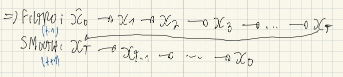

## Motivação

Em janeiro de 2025, o [BC Blog do Banco Central do Brasil](https://www.bcb.gov.br/noticiablogbc/29/noticia) publicou um post investigando um suposto descasamento entre o cenário macroeconômico brasileiro e a teoria econômica: a taxa de desemprego brasileira estava na mínima em duas décadas, enquanto a inflação de serviços ano contra ano estava rodando em um nível bem abaixo (~5%) daquele registrado (~8.5%) na última vez em que o desemprego foi igualmente baixo, em 2014. Se o mercado de trabalho estava tão aquecido, por que a morosidade da pressão inflacionária?

A resposta dos autores passa por uma ideia central em macroeconomia empírica: a **NAIRU** (a taxa de desemprego "neutra", que não acelera a inflação). A intuição básica é que quando a taxa de desemprego está abaixo da NAIRU, o mercado de trabalho está aquecido. Isso pressiona a inflação, especialmente via abertura de serviços dada a maior sensibilidade do setor ao fator de produção trabalho nos custos. Essa variável, contudo, além de não ser diretamente observável, também não é uma constante (*economics in a nutshell*). Ela se move ao longo do tempo, podendo assumir valores distintos em diferentes pontos do intervalo analisado. Para recuperá-la dos dados e tentar responder a pergunta posta, os autores utilizaram o arcabouço de uma **Curva de Phillips** e a técnica de **filtro de Kalman** para chegar nessa variável latente.

Como indicado por eles:

> Nossos resultados indicam que o mercado de trabalho está aquecido [desemprego abaixo da NAIRU], com o modelo prevendo uma inflação subjacente de serviços acima da observada recentemente, embora bem abaixo dos níveis registrados em meados da década passada. Afinal, tanto a inflação esperada quanto a passada são atualmente menores, assim como a nossa estimativa da NAIRU, que recuou após 2018, situando-se atualmente próxima da mínima histórica. Esses resultados, no entanto, estão sujeitos a uma elevada incerteza, especialmente no que se refere à NAIRU. Portanto, nossas conclusões, embora indicativas, não devem ser tomadas como definitivas.

Como alguém que já sofreu (*bastante*) para conseguir replicar exercícios de filtro de Kalman usando R, esse post tem dois objetivos:

- **Primeiro**, explicar o que é um filtro de Kalman e *por que* a matemática por trás dele permite estimar uma variável que ninguém observa. A ideia aqui é uma derivação simples junto de um exemplo teórico acessível para ilustrá-la. Esse mesmo exemplo, diga-se de passagem, me ajudou bastante lá atrás a entender esse método.

- **Segundo**, replicar o exercício do BCB do zero, com dados públicos, usando três pacotes de R diferentes ([`MARSS`](https://cran.r-project.org/web/packages/MARSS/index.html), [`KFAS`](https://cran.r-project.org/web/packages/KFAS/index.html) e [`kalmanfilter`](https://cran.r-project.org/web/packages/kalmanfilter/index.html)), comparando sintaxe e resultados entre eles.

Isso é a Parte 1. Na [Parte 2](0001-kalman-filter-pt2-bssm.qmd), vou re-estimar o mesmo exercício para uma amostra mais recente com um pacote Bayesiano (`bssm`, mais uma sintaxe de presente para os leitores), em duas versões — máxima verossimilhança e MCMC — para contrastar as abordagens frequentista e bayesiana dado exatamente o mesmo modelo.

## O que é um filtro de Kalman, e por que ele funciona

Um filtro de Kalman, fugindo do jargão técnico, resolve um problema geral: existem séries temporais $\mathbf{x}$ que você não observa diretamente, mas que evoluem no tempo segundo uma regra conhecida (ou que temos um chute sobre) e afetada por fatores aleatórios (ruídos). Além disso, existem séries observáveis $\mathbf{y}$ também contaminadas por ruídos, que carregam informações sobre esses estados ocultos. Na forma mais geral possível, esse par de equações (mais um estado inicial) é:

$$
y_t = Z_t x_t + a_t + D_t d_t + H_t v_t, \qquad v_t \sim MVN(0, R_t) \qquad \text{(equação de observação)}
$$

$$
x_t = B_t x_{t-1} + u_t + C_t c_t + G_t w_t, \qquad w_t \sim MVN(0, Q_t) \qquad \text{(equação de estado)}
$$

$$
x_0 \sim MVN(\hat x_0, P_0) \qquad \text{(estado inicial)}
$$

> Antes de uma breve intuição sobre os símbolos vale destacar um ponto de notação. Tudo abaixo tem subscrito $t$ porque descreve o **corte de um único instante**. Empilhando cortes ao longo dos $T$ períodos da amostra, o vetor $c\times1$ vira a matriz $c\times T$. É assim, por exemplo, que o manual do pacote `MARSS` chama $d$ (a série completa de covariáveis) de matriz $q\times T$, enquanto $d_t$ (a fatia num instante $t$), a mesma notação usada aqui, é um vetor $q\times1$. Mesma letra, dois objetos.

- $Z_t$: liga o estado não observável às observações.
- $a_t$: *drift* da equação de observação.
- $D_t, d_t$: efeito de covariáveis observadas sobre $y_t$ ($d_t$ é o vetor de covariáveis, $D_t$ a matriz de parâmetros).
- $R_t$: matriz de variância-covariância dos ruídos $v_t$ da equação de observação.
- $B_t$: como o estado evolui no tempo, de um período para o outro.
- $u_t$: *drift* da equação de estado (não confundir com o $u_t$ de desemprego, símbolo reaproveitado mais adiante na aplicação à NAIRU).
- $C_t, c_t$: efeito de covariáveis observadas sobre o próprio estado (mesma lógica de $D_t,d_t$, do lado da observação).
- $Q_t$: matriz de variância-covariância dos ruídos $w_t$ da equação de estado.
- $G_t, H_t$: matrizes de escala do ruído de estado e de observação. Na prática, costumam ser a matriz identidade, e portanto ficam implícitas.
- $x_0$ é uma escolha de modelagem que ancora a recursão antes da primeira observação (voltarei nisso).

**Por que usar essa técnica?** Sob as premissas acima (linearidade e normalidade), esse filtro não é só *uma* forma de responder a essa pergunta — é a solução **ótima** (menor erro quadrático médio) e em **forma fechada**. Filtragem bayesiana, em geral, atualiza a crença sobre um estado latente à medida que chegam dados e não tem solução analítica, exigindo simulação. O caso linear-gaussiano é a exceção em que a resposta exata sai de um punhado de operações matriciais.

**A mesma matemática, aplicações diferentes.** O que muda de uma aplicação para outra é só o que $x_t$ e $Z_t$ *representam*. As equações continuam sendo as mesmas.

- **Rastreamento** (a motivação original de Kalman, anos 1960): $x_t$ = posição e velocidade verdadeiras de um objeto (um foguete, um avião); $y_t$ = leitura ruidosa de um radar. Aqui o estado é uma quantidade física real, só não observada diretamente.
- **Nível não observável**: $x_t$ = a NAIRU, uma taxa de desemprego "de equilíbrio" sem contrapartida observável direta.
- **Coeficiente variante no tempo**: em muitas aplicações econométricas, o que varia no tempo não é um nível, e sim a **força de uma relação**. Por exemplo, a sensibilidade da inflação ao hiato do produto numa curva de Phillips, ano a ano. Isso cabe nas mesmas equações trocando o que $Z_t$ e $x_t$ significam:
$$y_t = x_t' z_t + v_t, \qquad x_t = x_{t-1} + w_t$$

onde agora $x_t'$ é o **vetor de coeficientes** (não mais um nível) e $z_t$ é o vetor de regressores observados. $Z_t$ virou $z_t'$, o próprio (vetor de) regressores, em vez de uma constante.

Basicamente, o filtro de Kalman responde a uma pergunta sequencial. Qual a cara de:

$$p(x_t \mid y_1, \dots, y_t)$$

— ou qual é a distribuição de probabilidade da variável de estado *hoje*, dado estado da natureza atual, i.e., tudo que foi observado até agora? Através dessa distribuição, você pode calcular os momentos da variável de estado *hoje*, chegando numa estimativa pontual e intervalos de confiança.

Um corolário prático, e particularmente relevante em economia: como a atualização é sequencial, o filtro incorpora um dado novo (uma obs. do PIB, inflação, payroll, etc) sem precisar processar a amostra inteira novamente para atualizar o estado. Isso torna esse ferramental natural para *nowcasting*, por exemplo. Nesse caso, os parâmetros já foram estimados e basta uma recursão do filtro para frente, com dados novos e parâmetros congelados, para atualizar ou obter novas estimativas da variável latente.

Para não haver confusão, aqui estamos falando estritamente do filtro. Um **suavizador / smoother** condiciona em toda a amostra, **revisando também todos os pontos passados**.

A seção a seguir deriva o processo de atualização para o segundo caso (nível não observado).

## Derivando a atualização do filtro com um exemplo estilizado

A partir daqui, vou usar um caso particular mais simples das equações apresentadas acima:

$$
y_t = Z_t x_t + v_t, \qquad v_t \sim N(0, R_t) \qquad \text{(equação de observação)}
$$

$$
x_t = B_t x_{t-1} + w_t, \qquad w_t \sim N(0, Q_t) \qquad \text{(equação de estado)}
$$

Por mais que jogue alguns termos fora, esse formato é mais que suficiente para compreender a lógica da atualização em um filtro de Kalman. Aqui troquei MVN por N, pois vou trabalhar com um exemplo em que $y_t$ e $x_t$ são escalares, i.e., apenas uma variável cada (inflação de serviços subjacentes e NAIRU, por exemplo).

Para ilustrar a derivação, vamos nos debruçar sobre o caso de nível não observado: $x_t$ escalar, como mencionado, com $Z_t$ e $B_t$ conhecidos (a notação continua seguindo o pacote `MARSS`).

> **Propriedades relevantes.** Nas subseções a seguir são utilizadas as seguintes propriedades da distribuição normal:<br>
> 1. Se $X$ é normal, então $AX+b$ também é normal (combinação linear/afim).<br>
> 2. Se $X$ e $W$ são conjuntamente gaussianos, $AX+W$ também é normal (soma de gaussianos).<br>
> 3. Se $(X,Y)$ é conjuntamente normal, então $X\mid Y=y$ também é normal (condicional de normal conjunta).

### Bayes, aplicado sequencialmente

Suponha que, depois de observar $y_1, \dots, y_{t-1}$, você já tem uma crença sobre $x_{t-1}$:

$$
x_{t-1}\mid y_{1:t-1} \sim N(\hat x_{t-1\mid t-1},\, P_{t-1\mid t-1})
$$

Essa também é a estimativa **atualizada** do passo anterior, já incorporando $y_{t-1}$.

A suposição de normalidade é o passo indutivo de um argumento por indução. O **passo indutivo** é mostrar que, partindo de uma normal em $t-1$, você chega numa normal em $t$.

Como não existe um "passo anterior" de verdade para $t=1$, é preciso simplesmente **escolher** uma distribuição inicial $x_0 \sim N(\hat x_0, P_0)$ — um chute de modelagem, não uma estimativa, tipicamente com $P_0$ difusa para refletir que você não sabe quase nada antes de ver dados. Como cada passo do ciclo preserva a propriedade, o chute inicial em $t=0$ é o único lugar da cadeia inteira onde a normalidade é *imposta* em vez de derivada. O resto segue por construção.

É isso que as próximas subseções derivam, primeiro propagando essa normal pela equação de estado (combinação linear de normais independentes continua normal), depois atualizando com $y_t$ via Bayes.

Portanto, antes de ver $y_t$, propague essa crença um passo à frente pela equação de estado. Tomando esperança e variância dos dois lados de $x_t = B_t x_{t-1}+w_t$ (usando que $w_t$ é independente de $x_{t-1}$ e de tudo observado até $t-1$):

A esperança de $x_t$ dado $y_{1:t-1}$ é:
$$
\hat x_{t\mid t-1} = B_t\hat x_{t-1\mid t-1}
$$

A variância de $x_t$ dado $y_{1:t-1}$ é:
$$
P_{t\mid t-1} = B_t P_{t-1\mid t-1}B_t' + Q_t
$$

Esse é o **passo de previsão**, ou seja, sua melhor previsão de $x_t$ antes de ver $y_t$, e a incerteza ao redor dela. Assim temos:

$$x_t \mid y_{1:t-1} \sim N\big(\hat{x}_{t\mid t-1},\, P_{t\mid t-1}\big)$$

Olhando agora para $y_t$. Por Bayes:

$$p(x_t \mid y_{1:t}) \;\propto\; p(y_t \mid x_t)\cdot p(x_t \mid y_{1:t-1})$$

$p(x_t\mid y_{1:t-1})$, que acabamos de derivar, já é uma densidade normal na variável $x_t$. O segundo termo, $p(y_t\mid x_t)$, precisa de mais cuidado. Pela equação de observação, $y_t\mid x_t \sim N(Z_t x_t,\, R_t)$, uma afirmação sobre a distribuição de $y_t$ *supondo $x_t$ conhecido*. É uma função de $y_t$.

Contudo, depois de observar o dado, a pergunta se inverte. $y_t$ já é um número conhecido, e queremos tratar $x_t$ como a incógnita.

> Essa troca de papéis é possível porque a fórmula $(y_t - Z_t x_t)^2$, dentro da exponencial da fórmula de uma normal, é uma forma quadrática tanto em $y_t$ quanto em $x_t$. Fixando o valor observado de $y_t$ e deixando $x_t$ variar, essa expressão continua sendo "uma quadrática dentro de uma exponencial", ou seja, a assinatura algébrica de um sino gaussiano só que agora como função de $x_t$. A mesma fórmula que definia a distribuição de $y_t$ (dado $x_t$) também tem cara de normal em $x_t$ (dado o $y_t$ que você observou), mesmo sem ser tecnicamente uma densidade normalizada em $x_t$. É uma **função de verossimilhança**.

Isso permite multiplicar essa peça pela prévia $p(x_t\mid y_{1:t-1})$ como se fossem duas normais na mesma variável $x_t$. O produto de duas funções com forma de normal em $x_t$ é, de novo, proporcional a uma normal em $x_t$. Resta apenas achar sua média e variância. Esse é o truque central da derivação.

### Condicionando direto em $y_t$

$x_t$ e $y_t$ vêm dos mesmos choques gaussianos primitivos. A história inteira de ruídos de estado $w_1,\dots,w_t$ e de observação $v_1,\dots,v_t$ (mais o estado inicial, também gaussiano). $x_t$ é combinação linear direta dessas peças, via a equação de estado aplicada recursivamente; $y_t = Z_t x_t + v_t$ também é, acrescido de um ruído igualmente gaussiano.

Portanto, $x_t$ e $y_t$ são duas combinações lineares diferentes, com coeficientes diferentes, do mesmíssimo conjunto de choques primitivos ($w_1, \dots, w_t$, $v_1,\dots,v_t$ e o estado inicial). Como combinações lineares de variáveis gaussianas independentes quaisquer têm distribuição conjuntamente normal, o par $(x_t, y_t)$ é **conjuntamente normal**.

Assim, dado $y_{1:t-1}$, com $\hat x_{t\mid t-1}$ e $P_{t\mid t-1}$ já calculados no passo de previsão:

$$
\begin{pmatrix} x_t \\ y_t \end{pmatrix} \Bigg| y_{1:t-1} \;\sim\; N\left(\begin{pmatrix}\hat{x}_{t\mid t-1}\\ Z_t\hat{x}_{t\mid t-1}\end{pmatrix},\; \begin{pmatrix} P_{t\mid t-1} & P_{t\mid t-1}Z_t' \\ Z_t P_{t\mid t-1} & Z_t P_{t\mid t-1}Z_t' + R_t\end{pmatrix}\right)
$$

A média e a variância de $y_t$ saem direto de $y_t = Z_t x_t + v_t$: esperança $Z_t\hat x_{t\mid t-1}$, variância $Z_tP_{t\mid t-1}Z_t' + R_t$. A covariância cruzada $\text{Cov}(x_t,y_t) = P_{t\mid t-1}Z_t'$ sai de $\text{Cov}(x_t,\,Z_tx_t+v_t)$, já que $v_t$ é independente de $x_t$.

Existe uma fórmula fechada e padrão para a distribuição condicional de uma normal multivariada. Se $(A,B)$ são conjuntamente normais, então

$$B\mid A \sim N\big(\mu_B + \Sigma_{BA}\Sigma_{AA}^{-1}(A-\mu_A),\; \Sigma_{BB}-\Sigma_{BA}\Sigma_{AA}^{-1}\Sigma_{AB}\big)$$

Aplicando direto com $A=y_t$, $B=x_t$:

$$x_t \mid y_{1:t} \sim N\big(\hat{x}_{t\mid t-1} + K_t(y_t - Z_t\hat x_{t\mid t-1}),\; P_{t\mid t-1} - K_t Z_t P_{t\mid t-1}\big), \qquad K_t \equiv P_{t\mid t-1}Z_t' S_t^{-1}, \quad S_t \equiv Z_tP_{t\mid t-1}Z_t'+R_t$$

Essa é a atualização do filtro de Kalman. O termo $y_t - Z_t\hat x_{t\mid t-1}$ — a diferença entre o que você observou e o que esperava observar antes de ver $y_t$ — tem nome próprio: **erro de previsão** (ou inovação), $e_t \equiv y_t - Z_t\hat x_{t\mid t-1}$, com $\text{Var}(e_t) = S_t$.

Com essa notação, a atualização acima fica $\hat x_{t\mid t} = \hat x_{t\mid t-1} + K_te_t$.

$K_t$, o **ganho de Kalman**, é uma razão sinal-ruído. Quanto maior a incerteza prévia $P_{t|t-1}$ relativa ao ruído de medição $R_t$, mais peso a atualização dá à nova observação $e_t$; quanto mais confiável a crença prévia ou mais ruidosa a medição, menos ela se move. Repetindo esse ciclo previsão → observação → atualização a cada $t$, o filtro percorre a série inteira, produzindo uma estimativa de $x_t$ (e sua incerteza) a cada período.

>Note que essa derivação nos dá pistas de por que o filtro de Kalman é **exato apenas no caso linear-gaussiano**. As três propriedades usadas das distribuições gaussianas dependem de $x_t$ ser combinação linear/afim de $x_{t-1}$, e de $y_t$ ser combinação linear/afim de $x_t$, com ruídos gaussianos. Se a dinâmica do estado ou a equação de observação forem não-lineares, ou os ruídos não forem gaussianos, a posterior $p(x_t\mid y_{1:t})$ geralmente deixa de ser normal e o filtro exato, em forma fechada, deixa de existir. Por esse motivo, instrumentos como o **filtro de Kalman estendido**, o **filtro de Kalman unscented** ou os **filtros de partículas** existem.

### Suavizador (smoother) e o algoritmo EM

O filtro usa só informação até $t$. O **suavizador** faz a mesma pergunta, mas condicionando em **toda** a amostra: $p(x_t \mid y_1, \dots, y_T)$, com $T>t$. Após rodar o filtro para frente, ele percorre a série de trás para frente, revisando cada $x_t$ com o que as observações *futuras* revelam.

{fig-alt="Diagrama mostrando o filtro passando para frente de x0 a xT e o suavizador voltando de xT a x0."}

### E os betas?

Falta um detalhe. Tudo acima assume que $Z_t, B_t, Q_t, R_t$ são conhecidos, mas na prática esses valores carregam parâmetros desconhecidos, que precisam ser estimados junto com o estado. Uma forma de fazer isso é maximizar diretamente a verossimilhança gaussiana implícita pelo filtro via um otimizador numérico. Uma outra alternativa é o **algoritmo EM**, que resolve o mesmo problema por outro caminho, estimando os parâmetros e recuperando os estados não observados ao mesmo tempo.

A dificuldade de maximizar a verossimilhança diretamente é que parâmetros e estados entram misturados na conta. Mudar um parâmetro muda a distribuição inteira dos estados, então não dá para otimizar um de cada vez. O EM contorna isso tratando os estados como **dados faltantes**, alternando entre duas etapas.

- **E-step**. Com os parâmetros atuais, roda o suavizador para obter a melhor estimativa dos estados (e sua incerteza) dado os dados observados.
- **M-step**. Com os estados suavizados em mãos, tratados como se fossem observados de verdade, reestima os parâmetros. Esse é um problema bem mais simples que o original, muitas vezes com solução em forma fechada.

Cada rodada usa parâmetros melhores para gerar estados melhores, e estados melhores para gerar parâmetros melhores. Otimização direta e EM maximizam exatamente a mesma verossimilhança gaussiana. EM é só um caminho alternativo até o mesmo máximo, mais atrativo quando há muitos parâmetros e o M-step tem forma fechada, o que evita depender de um otimizador genérico caro para tudo de uma vez.

Os três pacotes de R usados nesse post ilustram bem essa bifurcação. O `MARSS` roda **EM por padrão** (`method="kem"`, de *Kalman-EM*), mas o código abaixo troca explicitamente para `method="BFGS"`, otimizando a verossimilhança de forma direta. Já o `KFAS`, nesse exercício específico, nem chega a precisar de MLE explícito para $\beta,\gamma,\theta$, pois o truque do estado com prior difuso (detalhado na seção do `KFAS` mais abaixo) deixa o próprio suavizador recuperá-los, sem loop de otimização por fora. O `kalmanfilter`, por sua vez, não embute EM nem otimizador algum, e cabe a quem usa escrever o laço de MLE manualmente (com `optim` ou `maxLik`), como faremos na seção correspondente.

## A curva de Phillips do BCB como um filtro de Kalman

Apresentando a equação do exercício do BCB:

$$
\pi_t^{ss} = \alpha + \beta\cdot\pi_{t-1}^{12m} + (1-\beta)\cdot E_t(\pi^{LP}) - \gamma\cdot(u_t - u_t^*) + \theta\cdot \text{IPPCV}_t + \varepsilon_t
$$

onde $\pi_t^{ss}$ é a inflação subjacente de serviços, $u_t$ o desemprego observado, $u_t^*$ a NAIRU (a variável que queremos estimar), e os demais termos são componentes inercial, expectacional e de pressão de cadeia de suprimentos. $\alpha$ é **calibrado** em 1.1 p.p. Com $u_t^*$ variando livremente no tempo e não sendo observável, essa equação vira exatamente um problema de filtro de Kalman.

### Isolando o estado

Reorganizando a equação estrutural para separar o que é conhecido do que multiplica o estado:

$$
\pi_t^{ss} = \underbrace{\alpha + \beta\cdot\pi_{t-1}^{12m} + (1-\beta)\cdot E_t(\pi^{LP}) + \theta\cdot \text{IPPCV}_t - \gamma\cdot u_t}_{\text{conhecido, coeficiente fixo}} + \underbrace{\gamma\cdot u_t^*}_{Z_t\cdot x_t} + \underbrace{\varepsilon_t}_{v_t}
$$

com a NAIRU seguindo um passeio aleatório: $u_t^* = u_{t-1}^* + \vartheta_t$. Isso já é a equação de observação e de estado de um filtro de Kalman, mas repare que $\gamma$ aparece **duas vezes**. Uma vez como coeficiente do regressor observado $u_t$ (sinal negativo), outra como $Z_t$ multiplicando o estado $u_t^*$ (sinal positivo). Isso não é acidente — vem de o verdadeiro regressor ser o *hiato* $(u_t-u_t^*)$, não os dois termos separados — mas cria um problema prático. Teríamos que impor essa restrição (mesmo valor de $\gamma$ nos dois lugares) em cada pacote de R.

Uma saída mais simples: ao invés de tratar $u_t^*$ como estado, definimos o estado como a **NAIRU já escalada** por $\gamma$:

$$x_t \equiv \gamma \cdot u_t^*$$

Com essa mudança de variável, $Z_t=1$ (fixo, sem restrição nenhuma) e $\gamma$ aparece uma única vez, como coeficiente do regressor $u_t$. No fim, recuperamos a NAIRU de volta
dividindo o estado estimado por $\hat\gamma$: $u_t^* = x_t / \hat\gamma$.

O mesmo truque resolve $\beta$. Podemos reescrever $\beta\cdot\pi_{t-1}^{12m} + (1-\beta)\cdot E_t(...)$ como $E_t(...) + \beta\cdot(\pi_{t-1}^{12m}-E_t(...))$, deixando $\beta$ aparecer uma única vez, como coeficiente de uma única covariável construída $(\pi_{t-1}^{12m}-E_t(...))$.

Como no exercício do post, vamos impor $\lambda=120$ diretamente nos códigos abaixo.

### Estimação em dois estágios

Para evitar que a pandemia distorça os parâmetros estruturais, o BCB estima em dois estágios:

1. **1º estágio** (dez/2001–dez/2019, IPPCV zero nessa janela inteira): $\alpha$ calibrado, $\beta$ e $\gamma$ estimados junto com a NAIRU dessa subamostra.
2. **2º estágio** (dez/2001–nov/2024): $\alpha,\beta,\gamma$ agora **fixos** (vindos do 1º estágio) — só $\theta$ e a NAIRU final (mais $Q,R$) seguem livres.

O 2º estágio é mais simples de configurar: com $\beta,\gamma$ conhecidos, dá pra pré-computar um $y_t$ líquido dos termos já fixos, sobrando uma forma de nível local + regressor conhecido:

$$
\underbrace{\pi_t^{ss} - \alpha - \beta\cdot\pi_{t-1}^{12m} - (1-\beta)\cdot E_t(\pi^{LP}) + \gamma\cdot u_t}_{y_t \text{ líquido}} = \theta\cdot \text{IPPCV}_t + x_t + \varepsilon_t
$$

## Dados

Os dados de entrada (desemprego dessazonalizado, inflação subjacente de serviços, IPCA cheio, expectativas do Focus, índice de pressão de cadeia de suprimentos) vêm de séries públicas do IBGE e BCB, que eu normalmente colho através de uma infra de dados própria. O código dessa etapa apresentado abaixo, por causa disso, não é diretamente replicável em qualquer computador. Contudo, no R, pacotes como `sidrar` e `GetBCBData` (eternamente grato por eles terem botado check automático da API bastante instável do BCB SGS) ou `rbcb` podem fazer esse trabalho.

```{r}
#| eval: false
#| code-summary: "Mostrar código de coleta de dados (datalake.utils, não executado)"
suppressMessages({
  library(here)
  library(jsonlite)
  library(datalake.utils)
})
Sys.setenv(TZ = "America/Sao_Paulo")

# IPCA -----
dataset_id <- paste(c(c("latam", "brasil"), "ipca"), collapse = "-")

ipca_ssubj <-
  read_vintage(dataset_id, table = "db_difex_des") %>%
  filter(Ssubj == TRUE) %>%
  reframe(date, group, var = `Variável`, value = Valor) %>%
  pivot_wider(names_from = var, values_from = value) %>%
  rename(inf = 3, w = 4) %>%
  reframe(
    date,
    group,
    inf,
    w = ifelse(is.na(w), first(w[!is.na(w)]), w),
    .by = group
  ) %>%
  na.omit() %>%
  arrange(date) %>%
  select(date, inf, w) %>%
  reframe(ipca_ssubj = weighted.mean(inf, w), .by = date) %>%
  mutate(ipca_ssubj = (1 + ipca_ssubj / 100)^12 - 1)

ipca_full <-
  read_vintage(dataset_id, table = "db/ag") %>%
  filter(
    `Variável` ==
      "IPCA - Número-índice (base: dezembro de 1993 = 100) (Número-índice)"
  ) %>%
  select(date, Valor) %>%
  reframe(date, ipca_full = (Valor / lag(Valor, 12) - 1)) %>%
  na.trim("left")

# PNAD (desemprego dessazonalizado) -----
u_rate <-
  read_csv(here("pnad_desemprego_monthly.csv")) %>%
  reframe(
    date,
    u_rate = seas_dplyr(
      u_rate,
      year(first(date)),
      month(first(date)),
      12,
      "x13"
    )
  )

# FOCUS (expectativas) -----
dataset_id <- paste(c(c("latam", "brasil"), "focus"), collapse = "-")
focus <-
  read_vintage(dataset_id, table = "db_focus_annual") %>%
  filter(Indicador == "IPCA") %>%
  reframe(date = Data, DataReferencia, focus = Media) %>%
  mutate(ym = as.yearmon(date)) %>%
  group_by(ym) %>%
  filter(date == max(date)) %>%
  slice_max(DataReferencia, n = 1, with_ties = FALSE) %>%
  ungroup() %>%
  select(-ym, -DataReferencia) %>%
  mutate(date = date %>% as.yearmon() %>% as_date())

# IPPCV (índice de pressão de cadeia de suprimentos) -----
ippcv <- read_excel(here("ippcv.xlsx")) %>%
  reframe(date = as_date(`Mês`), ippcv)

# Junta tudo -----
db_final <-
  reduce(
    list(ipca_ssubj, ipca_full, u_rate, focus, ippcv),
    left_join,
    by = "date"
  ) %>%
  mutate(ippcv = ifelse(is.na(ippcv), 0, ippcv)) %>%
  na.trim("left") %>%
  filter(date >= "2001-12-01")
```

Nesse post, uso diretamente o resultado dessa etapa (`db_final.csv`) como ponto de partida. Assim quem quiser reproduzir o código abaixo não precisa da minha infra proprietária, só do CSV:

```{r}
#| label: setup
#| message: false
#| warning: false
library(tidyverse)
library(knitr)
library(MARSS)
library(KFAS)
library(kalmanfilter)
source("R/theme_blog.R")

db <- read.csv("data/kalman-filter/db_final.csv") %>%
  mutate(date = as.Date(date))

# Todas as séries de inflação/expectativa entram como 100*log(1+x), anualizadas
# (metodologia do BCB); desemprego e IPPCV entram em pontos percentuais/nível.
db <- db %>%
  arrange(date) %>%
  mutate(
    pi_ssubj = 100 * log1p(ipca_ssubj),
    pi_full = 100 * log1p(ipca_full),
    pi_full_lag1 = lag(pi_full, 1),
    E_t = 100 * log1p(focus / 100),
    u_t = 100 * u_rate
  )

alpha <- 1.1 # calibrado, não estimado
lambda <- 120 # razão sinal-ruído central do exercício do BCB

kable(head(db %>% select(date, pi_ssubj, pi_full_lag1, E_t, u_t, ippcv), 3))
```

## Três pacotes de R para filtro de Kalman

Vou estimar o mesmo modelo com três pacotes que representam filosofias diferentes de implementação.

Um aviso de notação antes de começar. Cada pacote reutiliza letras como `H`, `R`, `T`, `F` com significados próprios, que não necessariamente coincidem com a notação geral usada acima. Vale conferir a documentação de cada um antes de comparar símbolo a símbolo.

### MARSS

[`MARSS`](https://atsa-es.github.io/MARSS/) (Multivariate Autoregressive State-Space) é feito para séries temporais multivariadas, mas implementa o modelo de espaço de estados genérico exatamente na notação usada acima ($Z, B, Q, R$). Sua interface é declarativa. Você descreve as matrizes do modelo como uma lista, incluindo quais entradas são parâmetros livres (por nome) e quais são fixas, e o pacote cuida do resto.

#### 1º estágio

```{r}
#| label: marss-stage1
stage1 <- db %>%
  filter(date >= as.Date("2001-12-01"), date <= as.Date("2019-12-01")) %>%
  filter(!is.na(pi_full_lag1))

y1 <- matrix(pull(stage1, pi_ssubj) - alpha - pull(stage1, E_t), nrow = 1)
c_t <- pull(stage1, pi_full_lag1) - pull(stage1, E_t) # covariável de beta
d_t <- -pull(stage1, u_t) # covariável de gamma (sinal já invertido)

# Q, R fixos na razão 1/lambda
model_marss_1 <- list(
  B = matrix(1),
  U = matrix(0),
  Q = matrix(1 / lambda),
  Z = matrix(1),
  A = matrix(0),
  R = matrix(1),
  D = matrix(list("beta", "gamma"), 1, 2),
  d = rbind(c_t, d_t),
  x0 = matrix("x0"),
  V0 = matrix(1e6),
  tinitx = 0
)

time_marss_1 <- system.time(
  fit_marss_1 <- MARSS(
    y1,
    model = model_marss_1,
    method = "BFGS",
    silent = TRUE,
    control = list(maxit = 2000, reltol = 1e-12)
  )
)[["elapsed"]]

beta_marss <- coef(fit_marss_1)$D[1]
gamma_marss <- coef(fit_marss_1)$D[2]
cat("beta =", round(beta_marss, 4), " gamma =", round(gamma_marss, 4), "\n")
```

#### 2º estágio

Com $\beta,\gamma$ fixos, pré-computamos o $y_t$ líquido e sobra só $\theta$ e o estado:

```{r}
#| label: marss-stage2
stage2 <- db %>%
  filter(date >= as.Date("2001-12-01"), date <= as.Date("2024-11-01")) %>%
  filter(!is.na(pi_full_lag1))

y2 <- matrix(
  pull(stage2, pi_ssubj) -
    alpha -
    beta_marss * pull(stage2, pi_full_lag1) -
    (1 - beta_marss) * pull(stage2, E_t) +
    gamma_marss * pull(stage2, u_t),
  nrow = 1
)

model_marss_2 <- list(
  B = matrix(1),
  U = matrix(0),
  Q = matrix(1 / lambda),
  Z = matrix(1),
  A = matrix(0),
  R = matrix(1),
  D = matrix(list("theta"), 1, 1),
  d = matrix(stage2$ippcv, nrow = 1),
  x0 = matrix("x0"),
  V0 = matrix(1e6),
  tinitx = 0
)

time_marss_2 <- system.time(
  fit_marss_2 <- MARSS(
    y2,
    model = model_marss_2,
    method = "BFGS",
    silent = TRUE,
    control = list(maxit = 2000, reltol = 1e-12)
  )
)[["elapsed"]]

theta_marss <- coef(fit_marss_2)$D[1]

# Escala concentrada: com R=1 fixo, o filtro acerta o FORMATO da incerteza do
# estado mas não a escala absoluta. Recupera-se via sigma2_hat = mean(e_t^2/F_t)
# e reescala a variância do estado por sigma2_hat antes de formar o IC.
kf_marss <- MARSSkfss(fit_marss_2)
sigma2_marss <- mean(as.numeric(kf_marss$Innov)^2 / as.numeric(kf_marss$Sigma))

sm_marss <- tsSmooth(fit_marss_2, type = "xtT")
nairu_marss <- tibble(
  date = stage2$date,
  pkg = "MARSS",
  nairu = sm_marss$.estimate / gamma_marss,
  se = sm_marss$.se * sqrt(sigma2_marss) / gamma_marss
)

cat("theta =", round(theta_marss, 4), "\n")
```

### KFAS

[KFAS](https://cran.r-project.org/package=KFAS) vem da tradição de Durbin & Koopman, na qual implementa o filtro de Kalman com **inicialização difusa exata**. O estado inicial pode ter variância infinita, tratada analiticamente, não aproximada. Isso é particularmente relevante aqui, pois a NAIRU é não-estacionária, como um passeio aleatório puro, então não existe uma variância "de equilíbrio" natural para inicializar o filtro.

A sintaxe é baseada em fórmula. O modelo é descrito como uma soma de componentes (`SSMregression` para regressores comuns, `SSMcustom` para um bloco de estado sob medida).

#### 1º estágio

```{r}
#| label: kfas-stage1
y1_v <- pull(stage1, pi_ssubj) - alpha - pull(stage1, E_t)

model_kfas_1 <- SSModel(
  y1_v ~ -1 +
    SSMregression(~ c_t + d_t, Q = 0, a1 = c(0, 0), P1 = diag(c(1e6, 1e6))) +
    SSMcustom(Z = 1, T = 1, R = 1, Q = 1 / lambda, a1 = 0, P1inf = 1),
  H = matrix(1)
)

time_kfas_1 <- system.time(
  out_kfas_1 <- KFS(model_kfas_1, smoothing = "state")
)[["elapsed"]]
beta_kfas <- out_kfas_1$alphahat[nrow(out_kfas_1$alphahat), "c_t"]
gamma_kfas <- out_kfas_1$alphahat[nrow(out_kfas_1$alphahat), "d_t"]

cat("beta =", round(beta_kfas, 4), " gamma =", round(gamma_kfas, 4), "\n")
```

Repare no código acima que aqui `beta`/`gamma` não são "parâmetros" no sentido de MLE explícito. No caso do `MARSS` existe uma chamada de otimizador, separada do filtro, cujo único trabalho é achar o `theta` que maximiza a log-verossimilhança. Aqui o `beta` e `gamma` não vêm de nenhum `optim()`. Eles são coeficientes de `SSMregression` que entra no mesmo vetor de estado que o nível `SSMcustom`. Porém, com `Q=0` (constante disfarçada de estado) e `P1 = diag(c(1e6, 1e6))` (prior não informativo), eles são tratados como estados com prior difuso e variância zero, logo, constantes no tempo. Nesse regime específico o suavizador entrega o mesmo ponto que MLE entregaria, só que embutido no próprio filtro.

#### 2º estágio

```{r}
#| label: kfas-stage2
y2_v <- pull(stage2, pi_ssubj) -
  alpha -
  beta_kfas * pull(stage2, pi_full_lag1) -
  (1 - beta_kfas) * pull(stage2, E_t) +
  gamma_kfas * pull(stage2, u_t)
ippcv_t <- pull(stage2, ippcv)

model_kfas_2 <- SSModel(
  y2_v ~ -1 +
    SSMregression(~ippcv_t, Q = 0, a1 = 0, P1 = matrix(1e6)) +
    SSMcustom(Z = 1, T = 1, R = 1, Q = 1 / lambda, a1 = 0, P1inf = 1),
  H = matrix(1)
)

time_kfas_2 <- system.time(
  out_kfas_2 <- KFS(model_kfas_2, smoothing = "state")
)[["elapsed"]]
theta_kfas <- out_kfas_2$alphahat[1, "ippcv_t"]

innov_kfas <- as.numeric(out_kfas_2$v)
Ft_kfas <- as.numeric(out_kfas_2$F)
valid_kfas <- is.finite(innov_kfas) & is.finite(Ft_kfas) & Ft_kfas > 0
sigma2_kfas <- mean(innov_kfas[valid_kfas]^2 / Ft_kfas[valid_kfas])

nairu_kfas <- tibble(
  date = stage2$date,
  pkg = "KFAS",
  nairu = out_kfas_2$alphahat[, 2] / gamma_kfas,
  se = sqrt(out_kfas_2$V[2, 2, ] * sigma2_kfas) / gamma_kfas
)

cat("theta =", round(theta_kfas, 4), "\n")
```

### kalmanfilter

[`kalmanfilter`](https://cran.r-project.org/package=kalmanfilter) é o mais "cru" dos três. Uma implementação Rcpp (*C++ no R*) direta das sete equações derivadas no exemplo estilizado acima, sem inicialização difusa exata, sem interface de fórmula. Você monta as matrizes ($A, H, D, F, Q, R$, na notação própria do pacote) e escreve seu próprio laço de otimização por fora com `optim` ou `maxLik`. Isso obviamente dá mais controle. Inclusive, dá para impor a restrição de $\gamma$ compartilhado *diretamente*, sem precisar do truque do estado reescalado — embora, como veremos mais adiante, essa escolha não seja numericamente inócua. As duas formas impõem a mesma restrição algébrica, mas levam a verossimilhanças diferentes.

#### 1º estágio

```{r}
#| label: kalmanfilter-stage1
y1_row <- matrix(pull(stage1, pi_ssubj) - alpha - pull(stage1, E_t), nrow = 1)
Tn1 <- ncol(y1_row)

build_ssm_1 <- function(par) {
  beta <- par[1]
  gamma <- par[2]
  list(
    B0 = matrix(0),
    P0 = matrix(1e6),
    Dm = array(0, dim = c(1, 1, Tn1)),
    Am = array(beta * c_t - gamma * stage1$u_t, dim = c(1, 1, Tn1)), # gamma aqui...
    Fm = array(1, dim = c(1, 1, Tn1)),
    Hm = array(gamma, dim = c(1, 1, Tn1)), # ...e aqui: mesma variável gamma
    Qm = array(1 / lambda, dim = c(1, 1, Tn1)),
    Rm = array(1, dim = c(1, 1, Tn1))
  )
}
objective_1 <- function(par) {
  ll <- kalman_filter(build_ssm_1(par), y1_row, smooth = FALSE)$lnl
  if (!is.finite(ll)) {
    return(1e10)
  }
  -ll
}

time_kf_1 <- system.time(
  fit_kf_1 <- optim(
    par = c(beta = 1, gamma = 0.5),
    fn = objective_1,
    method = "BFGS",
    control = list(maxit = 5000, reltol = 1e-14)
  )
)[["elapsed"]]
beta_kf <- fit_kf_1$par[1]
gamma_kf <- fit_kf_1$par[2]

cat("beta =", round(beta_kf, 4), " gamma =", round(gamma_kf, 4), "\n")
```

#### 2º estágio

```{r}
#| label: kalmanfilter-stage2
y2_row <- matrix(
  pull(stage2, pi_ssubj) -
    alpha -
    beta_kf * pull(stage2, pi_full_lag1) -
    (1 - beta_kf) * pull(stage2, E_t) +
    gamma_kf * pull(stage2, u_t),
  nrow = 1
)
Tn2 <- ncol(y2_row)

build_ssm_2 <- function(theta) {
  list(
    B0 = matrix(0),
    P0 = matrix(1e6),
    Dm = array(0, dim = c(1, 1, Tn2)),
    Am = array(theta * pull(stage2, ippcv), dim = c(1, 1, Tn2)),
    Fm = array(1, dim = c(1, 1, Tn2)),
    Hm = array(1, dim = c(1, 1, Tn2)),
    Qm = array(1 / lambda, dim = c(1, 1, Tn2)),
    Rm = array(1, dim = c(1, 1, Tn2))
  )
}
objective_2 <- function(theta) {
  ll <- kalman_filter(build_ssm_2(theta), y2_row, smooth = FALSE)$lnl
  if (!is.finite(ll)) {
    return(1e10)
  }
  -ll
}

time_kf_2 <- system.time(
  fit_kf_2 <- optimize(objective_2, interval = c(-5, 5), tol = 1e-10)
)[["elapsed"]]
theta_kf <- fit_kf_2$minimum

filt_kf <- kalman_filter(build_ssm_2(theta_kf), y2_row, smooth = TRUE)
innov_kf <- as.numeric(filt_kf$N_t)
Ft_kf <- as.numeric(filt_kf$F_t)
valid_kf <- is.finite(innov_kf) & is.finite(Ft_kf) & Ft_kf > 0
sigma2_kf <- mean(innov_kf[valid_kf]^2 / Ft_kf[valid_kf])

nairu_kf <- tibble(
  date = stage2$date,
  pkg = "kalmanfilter",
  nairu = as.numeric(filt_kf$B_tt) / gamma_kf,
  se = sqrt(as.numeric(filt_kf$P_tt) * sigma2_kf) / gamma_kf
)

cat("theta =", round(theta_kf, 4), "\n")
```

No **1º estágio**, o `kalmanfilter` chega em $\gamma$ visivelmente mais alto que MARSS/KFAS.

A causa é a **parametrização de $\gamma$**. MARSS/KFAS usam o truque do estado reescalado ($Z_t=1$ fixo, $\gamma$ só como coeficiente de regressão). O `kalmanfilter`, como codificado, impõe a restrição compartilhada *diretamente*, com $Z_t=\gamma$. A diferença não é só de sintaxe — muda a variância da inovação, $F_t=\gamma^2 P_{t|t-1}+R_t$. Com $Z_t=1$, $\gamma$ nunca entra em $F_t$; com $Z_t=\gamma$, entra, e enquanto $P_{t|t-1}$ não converge ao regime, essa dependência extra distorce a verossimilhança e empurra $\hat\gamma$ para cima.

Reescrevendo o `kalmanfilter` com $Z_t=1$, mesmo truque de MARSS/KFAS, o resultado bate **exato** com os outros dois.

No **2º estágio**, com $\gamma$ já fixo, esse problema desaparece. Os três pacotes convergem para praticamente o mesmo $\theta$ e a mesma trajetória de NAIRU, como veremos a seguir.

## Resultados

### Coeficientes

```{r}
#| label: tbl-coefs
time_marss <- time_marss_1 + time_marss_2
time_kfas <- time_kfas_1 + time_kfas_2
time_kf <- time_kf_1 + time_kf_2

tbl_coefs <- tibble(
  Pacote = c("MARSS", "KFAS", "kalmanfilter", "Paper original (BCB)"),
  beta = c(
    sprintf("%.4f", unname(beta_marss)),
    sprintf("%.4f", unname(beta_kfas)),
    sprintf("%.4f", unname(beta_kf)),
    "0.30 (0.10)"
  ),
  gamma = c(
    sprintf("%.4f", unname(gamma_marss)),
    sprintf("%.4f", unname(gamma_kfas)),
    sprintf("%.4f", unname(gamma_kf)),
    "0.67 (0.26)"
  ),
  theta = c(
    sprintf("%.4f", unname(theta_marss)),
    sprintf("%.4f", unname(theta_kfas)),
    sprintf("%.4f", unname(theta_kf)),
    "1.32"
  ),
  tempo = c(
    sprintf("%.2f", time_marss),
    sprintf("%.2f", time_kfas),
    sprintf("%.2f", time_kf),
    "—"
  )
)
kable(
  tbl_coefs,
  col.names = c("Pacote", "β (1º estágio)", "γ (1º estágio)", "θ (2º estágio)", "Tempo (s)"),
  align = c("l", "r", "r", "r", "r")
)
```

Para referência, a linha "Paper original" reporta os valores da Tabela 1 do blogpost ($\lambda=120$), com erro-padrão entre parênteses. Nossos números do MARSS/KFAS ficam dentro de 1 desvio-padrão do paper em ambos os coeficientes. A diferença é esperada, já que os dados usados vêm de uma infra própria, com filtro sazonal e retropolação da PNAD próprias. O `kalmanfilter`, pelas razões discutidas acima, diverge um pouco mais em $\gamma$ no 1º estágio, mas convergiu para $\theta$ virtualmente idêntico no 2º.

### A trajetória da NAIRU

```{r}
#| label: fig-nairu
#| fig-cap: "NAIRU estimada (com IC 95%) pelos três pacotes, dez/2001–nov/2024."
nairu_all <- bind_rows(nairu_marss, nairu_kfas, nairu_kf) %>%
  mutate(lower = nairu - 1.96 * se, upper = nairu + 1.96 * se)

ggplot(nairu_all, aes(date, nairu, color = pkg, fill = pkg)) +
  geom_ribbon(aes(ymin = lower, ymax = upper), alpha = 0.12, color = NA) +
  geom_line(linewidth = 0.8) +
  scale_color_blog(tier = "extended", n = 3) +
  scale_fill_blog(tier = "extended", n = 3) +
  scale_x_date_blog(nairu_all$date) +
  labs(
    title = "NAIRU estimada pelos três pacotes",
    subtitle = "% da força de trabalho, IC 95%, dez/2001–nov/2024",
    x = NULL,
    caption = caption_blog("BCB")
  ) +
  theme_blog()
```

::: {.zoomable-figure}
:::

O padrão bate com o que o post do BCB descreve. A NAIRU fica perto de 10% até aproximadamente 2018, depois recua de forma persistente, chegando perto da mínima histórica recente. Os três pacotes concordam na forma; o nível do `kalmanfilter` fica sistematicamente um pouco abaixo dos outros dois, consequência direta do $\gamma$ mais alto que ele estimou no 1º estágio (lembrando que $u_t^* = x_t/\gamma$, logo um $\gamma$ maior comprime a NAIRU implícita).

Contudo, parece haver uma questão de nível aqui, em que as curvas estão um pouco acima dos valores expostos no post do BCB no período pré ~2015. Volto nesse ponto mais adiante.

### Comparando 2014 com o fim da amostra

Usei aqui os resultados do pacote `MARSS` para replicar a tabela exposta no final do post. Dito isso, os outros seriam qualitativamente bastante próximos:

```{r}
#| label: tbl-comparison

# ipca_full/ipca_ssubj entram cruas (sem o log) aqui: "Inflação passada" e
# "Expectativa LP" usam a série antes da transformação 100*log1p(x) exigida
# só para a estimação do modelo. O observado de serviços vira acumulado 12m:
# como ipca_ssubj só está salvo já anualizado (mensal composto por 12),
# inverto essa anualização pra recuperar o mensal e componho os 12 meses
# até target_date — mesma base do π^{ss,12m} da Tabela 2 do BCB.
db_ord <- db %>%
  arrange(date) %>%
  mutate(ipca_full_lag1_pct = lag(ipca_full, 1) * 100)

ssubj_accum_12m <- function(target_date) {
  target_date <- as_date(target_date)
  window <- db_ord %>%
    filter(date > target_date %m-% months(12), date <= target_date)
  monthly <- (1 + window$ipca_ssubj)^(1 / 12) - 1
  100 * (prod(1 + monthly) - 1)
}

compare_row <- function(target_date) {
  target_date <- as_date(target_date)
  row <- stage2 %>% filter(date == target_date)
  row_raw <- db_ord %>% filter(date == target_date)
  nairu_row <- nairu_marss %>% filter(date == target_date)
  pred <- alpha +
    beta_marss * pull(row, pi_full_lag1) +
    (1 - beta_marss) * pull(row, E_t) -
    gamma_marss * (pull(row, u_t) - pull(nairu_row, nairu)) +
    theta_marss * pull(row, ippcv)
  tibble(
    Data = format(target_date, "%b/%Y"),
    `Inflação passada (12m)` = round(pull(row_raw, ipca_full_lag1_pct), 1),
    `Expectativa LP` = round(pull(row_raw, focus), 1),
    `Hiato (u - NAIRU)` = round(pull(row, u_t) - pull(nairu_row, nairu), 1),
    `π ssubj. previsto` = round(100 * (exp(pred / 100) - 1), 1),
    `π ssubj. observado (12m)` = round(ssubj_accum_12m(target_date), 1)
  )
}

kable(bind_rows(compare_row("2014-03-01"), compare_row("2024-11-01")))
```

Aqui faço uma série de *caveats*. **Qualitativamente** a tabela de comparação bate com os resultados do blogpost, e já vou explorá-los. Porém, os números que deveriam ser os mais fáceis de cravar (inflação cheia observada no período anterior, inflação de serv. subjacentes observada) ironicamente ficaram bem distantes dos valores reportados. Para março de 2014, a inflação cheia no post é de 4.8%. Ao olhar para março (ou fevereiro), tanto dessaz. (o que não faria muito sentido, pois é um yoy) quanto sem ajuste não chego nesse valor, ficando em torno de 5.5%, 5.7%. No *footnote v* os autores deixam a entender que há uma reponderação do IPCA com os pesos atuais (novembro de 2024?), mas mesmo fazendo isso também não consigo me aproximar.

Dado o desvio também da inflação de serv. subjacentes, com altíssima probabilidade estou deixando algo passar. Também acredito que o descasamento de nível da minha NAIRU possa ter a ver com isso. Contudo, não fui capaz de desvendar esse mistério (*e se alguém tiver conseguido, não hesite em falar comigo!*).

Dito isso, o resultado qualitativo ainda é bom e bate com a intuição do post original. Citando eles aqui para fechar esse primeiro post:

> Usando o arcabouço da curva de Phillips, foi possível entender como a inflação subjacente de serviços recente foi menor do que a observada em 2014, quando a taxa de desemprego era igualmente baixa. Atualmente, o mercado de trabalho pressiona menos a inflação, dada a queda estimada da NAIRU entre 2018 e 2023, além dos componentes inercial e, em especial, expectacional serem agora menores. Mesmo assim, nossos resultados sugerem que a inflação recente já está acima do nível compatível com a meta de inflação.
