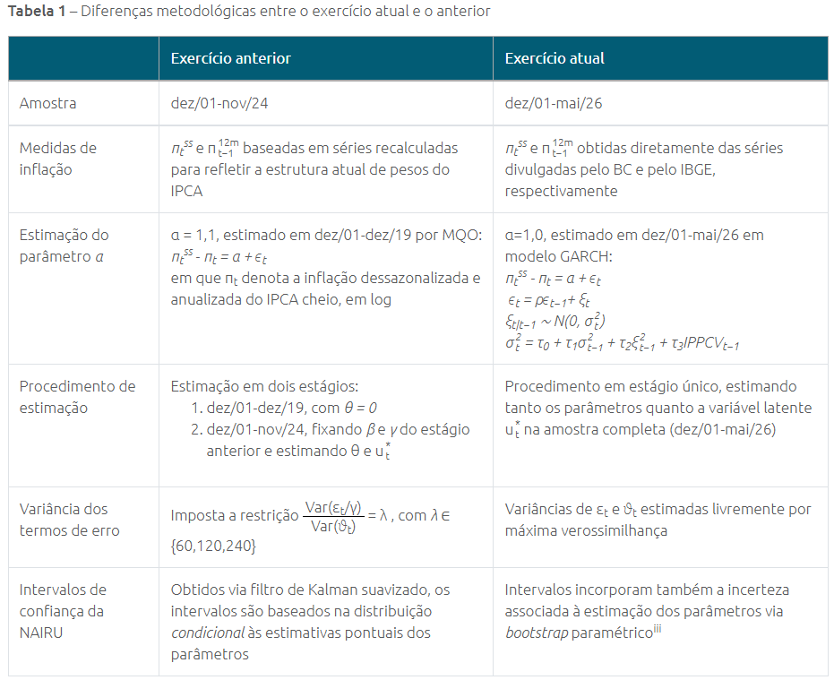

## Motivação

Na [Parte 1](0001-kalman-filter-pt1-nairu.qmd) deste post, derivei o filtro de Kalman de forma simples e o usei para replicar um exercício interessante do BC Blog ([post nº29](https://www.bcb.gov.br/noticiablogbc/29/noticia) do Thiago Trafane): estimar uma NAIRU variante no tempo a partir de uma curva de Phillips de serviços. O objetivo central era ter uma aplicação útil da teoria construída, e demonstrar na prática como usar esta técnica através de três pacotes diferentes de R ([`MARSS`](https://atsa-es.github.io/MARSS/), [`KFAS`](https://cran.r-project.org/web/packages/KFAS/index.html), e [`kalmanfilter`](https://cran.r-project.org/web/packages/kalmanfilter/index.html)).

Depois da divulgação da Parte 1, o autor do post original publicou uma atualização desse exercício. O post [nº46 do BC Blog](https://www.bcb.gov.br/noticiablogbc/46/noticia), "Inflação de serviços à luz da curva de Phillips: uma atualização", incorpora dados mais recentes e uma metodologia levemente diferente. Ela passou a ser realizada em **estágio único** (todos os parâmetros e a NAIRU estimados conjuntamente na amostra completa) e com **$\lambda$ livre** (não mais calibrado em 120), entre outras alterações.

Esta Parte 2 replica essa versão mais recente, primeiro rodando o exercício atualizado nos três pacotes já usados na Parte 1 com breves comentários sobre as mudanças necessárias nos códigos e, depois, com o pacote [`bssm`](https://cran.r-project.org/package=bssm) em **duas versões**. Uma primeira via MLE e outra via MCMC, a forma idiomática de usar o pacote. O objetivo aqui, além de atualizar as estimativas desse modelo, é também comparar duas filosofias de inferência: a frequentista e a bayesiana.

Este post assume o modelo e a notação já estabelecidos no post da [Parte 1](0001-kalman-filter-pt1-nairu.qmd). Vale a pena lê-lo primeiro se você caiu direto aqui de paraquedas!

## Dados e setup

O post original exibe uma tabela resumindo as principais diferenças metodológicas entre os dois exercícios de forma clara e concisa. Reproduzo a tabela abaixo:

{fig-alt="Tabela comparando o exercício anterior e o atual em seis dimensões: amostra, medidas de inflação, estimação do parâmetro α, procedimento de estimação, variância dos termos de erro e intervalos de confiança da NAIRU."}

Entre as mudanças mais relevantes vale destacar a extensão da amostra até os dados mais recentes disponíveis (dez/2001–mai/2026, contra dez/2001–nov/2024 na Parte 1), a mudança da variável dependente que passou a ser o **núcleo EX3 Serviços** (aqui o chamarei intercambiavelmente de inflação de serviços subjacentes) publicado pelo BC no Sistema Gerenciador de Séries Temporais ([SGS](https://www3.bcb.gov.br/sgspub/localizarseries/localizarSeries.do?method=prepararTelaLocalizarSeries), código 29683), e a estimação em estágio único.

Além disso, o autor sugere uma fonte para o desemprego retropolado utilizado. No post anterior, eu havia utilizado uma reprodução minha do [Alves e Fasolo (2015)](https://www.bcb.gov.br/pec/wps/ingl/wps400.pdf) com um filtro sazonal próprio. Aqui, eu utilizo a fonte sugerida oficialmente: o RPM do BCB ([Relatório de Política Monetária de junho de 2026](https://www.bcb.gov.br/noticiablogbc/46/noticia#:~:text=anexo%20estat%C3%ADstico%20do%20Relat%C3%B3rio%20de%20Pol%C3%ADtica%20Monet%C3%A1ria%20de%20junho%20de%202026%2C%20na%20aba%20Graf%201.2.11.), na aba Graf 1.2.11). Ela, contudo, só cobre abr/2004 em diante, bem menos que a amostra completa utilizada no exercício original (dez/2001–mai/2026).

Comparei essa série oficial com a minha replicação nos meses em que as duas se sobrepõem e o ajuste é quase perfeito nos anos mais recentes. Por isso emendo as duas, mas só para frente, i.e., uso a série oficial de abr/2004 disponível no RPM até sua última data (abr/2026) e, dali em diante, utilizo a minha própria série até o fim da amostra disponível (mai/2026).

Escolhi apenas emendar para frente, pois fazer o mesmo para trás, cobrindo dez/2001–mar/2004, criaria um problema diferente. As duas séries divergem bem em nível nos primeiros anos em que tenho ambas disponíveis. Isso gera um degrau bem no início da trajetória de $u_t^*$ se eu apenas concatenar uma na outra. Eu teria que escolher entre adicionar um corretor de média *ad hoc* ou aceitar esse degrau esquisito na série temporal. Dessa forma, os resultados a seguir cobrem uma amostra mais longa do que se eu tivesse ficado só com o RPM como fonte, mas ainda mais curta que a do post nº46.

> Uma última propaganda antes dos códigos! Uso o pacote [`GetBCBData`](https://github.com/msperlin/GetBCBData) do Marcelo Perlin para baixar a série de inflação. Na minha opinião, é o pacote que lida melhor com a instabilidade constante (e bem mais constante do que eu gostaria) da API do BCB. De resto, Focus e IPPCV continuam vindo do mesmo pipeline interno proprietário destacado na Parte 1 e abaixo.

Como na parte anterior, documento o *snip* de código usando minha infraestrutura de dados própria (pacote proprietário `datalake.utils`) para montar a base de dados que salvo como um .csv e uso no restante do exercício.

```{r}
#| eval: false
#| code-summary: "Mostrar código de coleta de dados (datalake.utils, não executado)"
suppressMessages({
  library(here)
  library(jsonlite)
  library(datalake.utils)
  library(GetBCBData)
})
Sys.setenv(TZ = "America/Sao_Paulo")

# IPCA -----
dataset_id <- paste(c(c("latam", "brasil"), "ipca"), collapse = "-")

ex3 <-
  gbcbd_get_series(
    id = 29683,
    first.date = as.Date("2001-01-01"),
    last.date = Sys.Date()
  )

ipca_ssubj <-
  ex3 %>%
  arrange(ref.date) %>%
  reframe(date = ref.date, ipca_ssubj = (1 + value / 100)^12 - 1)

# PNAD (desemprego dessazonalizado) -----
u_rate <-
  read_delim(
    here("rpm0626_pnad_desemprego_monthly.csv"),
    delim = ";",
    locale = locale(encoding = "ISO-8859-1"),
    show_col_types = FALSE
  ) %>%
  reframe(
    date = as.Date(paste0("01-", `Mês`), format = "%d-%b-%Y"),
    u_rate = `Taxa de desocupação` / 100
  )

u_rate_mine <- read_csv(here("pnad_desemprego_retropolada.csv")) %>%
  reframe(
    date,
    u_rate = seas_dplyr(
      u_rate,
      year(first(date)),
      month(first(date)),
      12,
      "x13"
    )
  )

u_rate <-
  u_rate %>%
  bind_rows(filter(u_rate_mine, date > max(pull(., date))))

# FOCUS (expectativas) -----
dataset_id <- paste(c(c("latam", "brasil"), "focus"), collapse = "-")
focus <-
  read_vintage(dataset_id, table = "db_focus_annual") %>%
  filter(Indicador == "IPCA") %>%
  reframe(date = Data, DataReferencia, focus = Media) %>%
  mutate(ym = as.yearmon(date)) %>%
  group_by(ym) %>%
  filter(date == max(date)) %>%
  slice_max(DataReferencia, n = 1, with_ties = FALSE) %>%
  ungroup() %>%
  select(-ym, -DataReferencia) %>%
  mutate(date = date %>% as.yearmon() %>% as_date())

# IPPCV (índice de pressão de cadeia de suprimentos) -----
ippcv <- read_excel(here("ippcv.xlsx")) %>%
  reframe(date = as_date(`Mês`), ippcv)

# Junta tudo -----
db_final <-
  reduce(
    list(ipca_ssubj, ipca_full, u_rate, focus, ippcv),
    left_join,
    by = "date"
  ) %>%
  mutate(ippcv = ifelse(is.na(ippcv), 0, ippcv)) %>%
  na.trim("left") %>%
  filter(date >= "2001-12-01")
```

```{r}
#| label: setup
#| message: false
#| warning: false
library(dplyr)
library(ggplot2)
library(knitr)
library(bssm)
library(MARSS)
library(KFAS)
library(kalmanfilter)
library(tidyverse)
library(GetBCBData)
source("R/theme_blog.R")

db <- read_csv("data/kalman-filter/db_final_pt2.csv") %>%
  mutate(date = as_date(date))

db <- db %>%
  arrange(date) %>%
  mutate(
    pi_ssubj = 100 * log1p(ipca_ssubj),
    pi_full = 100 * log1p(ipca_full),
    pi_full_lag1 = lag(pi_full, 1),
    E_t = 100 * log1p(focus / 100),
    u_t = 100 * u_rate
  ) %>%
  filter(!is.na(pi_full_lag1), !is.na(u_t))

# Meta de inflação (CMN) por ano-calendário, na mesma aproximação log usada
# nas demais medidas de inflação/expectativa (100*log1p(x/100))
metas_cmn <- GetBCBData::gbcbd_get_series(
  id = 13521,
  first.date = as.Date("2001-01-01"),
  last.date = Sys.Date()
) %>%
  reframe(year = year(ref.date), meta = 100 * log1p(value / 100))

db <- db %>%
  mutate(year = as.integer(format(date, "%Y"))) %>%
  left_join(metas_cmn, by = "year")

alpha <- 1.0 # reutilizado do post nº46, não recalculado

# Formata "mês/ano" em português, independente do locale da máquina de render
mes_pt <- function(date) {
  meses <- c(
    "jan", "fev", "mar", "abr", "mai", "jun",
    "jul", "ago", "set", "out", "nov", "dez"
  )
  paste0(meses[as.integer(format(date, "%m"))], "/", format(date, "%Y"))
}

y_v <- db$pi_ssubj - alpha - db$E_t
c_t <- db$pi_full_lag1 - db$E_t # covariável de beta
d_t <- -db$u_t # covariável de gamma (sinal já invertido)
ippcv_t <- db$ippcv
n <- nrow(db)
```

Amostra final: `r mes_pt(min(db$date))`–`r mes_pt(max(db$date))`, $n=$ `r n` observações mensais, mais curta que as 294 do post nº46 (dez/2001–mai/2026) pelos ~29 meses do início (dez/2001–abr/2004) que ficam de fora.

## Revisitando a Parte 1: MARSS, KFAS e kalmanfilter no novo exercício

Antes de entrar no [`bssm`](https://cran.r-project.org/web/packages/bssm/index.html), vou revisitar como ficam os três pacotes já usados na Parte 1 ([`MARSS`](https://atsa-es.github.io/MARSS/), [`KFAS`](https://cran.r-project.org/web/packages/KFAS/index.html), e [`kalmanfilter`](https://cran.r-project.org/web/packages/kalmanfilter/index.html)) rodando o exercício atualizado.

Aqui vale perder um tempo para explicitar as mudanças que aparecem nos códigos dos três pacotes para atender às atualizações.

Começando pelo `MARSS`. Intuitivamente, a Parte 2 é o 1º estágio da Parte 1 rodando na amostra toda, com uma covariável a mais e com Q, R "soltos". O código passa a declarar $\beta,\gamma,\theta$ como parâmetros livres na matriz `D` (com as covariáveis em `d`). Sendo tudo calculado numa única etapa, todos os parâmetros são declarados de uma só vez, não havendo necessidade de dois passos.

Na Parte 1, em vez de estimar $\text{Var}(\varepsilon_t)$ e $\text{Var}(\vartheta_t)$ como dois números livres, o código fixa $R = 1$ (um valor arbitrário) e $Q = \frac{1}{\lambda}$ de forma que a razão `R/Q` seja exatamente $\lambda=120$. Isso pode ser feito, pois a trajetória do estado estimado depende apenas da razão `R/Q`, não das variâncias individuais. Entretanto, ao usar essa técnica, o erro-padrão do estado suavizado sai na escala errada e precisa de *rescaling* para estimar os intervalos de confiança corretamente.

Sem a restrição do $\lambda$, `Q`/`R` são variâncias livres e essa parte de *rescaling* não é mais necessária. É a própria chamada `MARSS(..., method = "BFGS")` que maximiza a verossimilhança dos cinco parâmetros de uma vez. O vetor `inits` ajuda a ancorar o problema, agora mais sensível ao ponto de partida.

```{r}
#| label: revisit-marss
#| code-fold: show
inits_revisit <- c(
  beta = 0.27,
  gamma = 0.6,
  theta = 1.2,
  log_sd_y = log(1.6),
  log_sd_level = log(0.13)
)

y_row <- matrix(y_v, nrow = 1)
model_marss_1s <- list(
  B = matrix(1),
  U = matrix(0),
  Q = matrix("q"),
  Z = matrix(1),
  A = matrix(0),
  R = matrix("r"),
  D = matrix(list("beta", "gamma", "theta"), 1, 3),
  d = rbind(c_t, d_t, ippcv_t),
  x0 = matrix("x0"),
  V0 = matrix(1e6),
  tinitx = 0
)
fit_marss <- MARSS(
  y_row,
  model = model_marss_1s,
  method = "BFGS",
  silent = TRUE,
  inits = list(
    x0 = 0,
    Q = matrix(0.02),
    R = matrix(2),
    D = matrix(c(0.27, 0.6, 1.2), 1, 3)
  ),
  control = list(maxit = 5000, reltol = 1e-12)
)

beta_marss <- coef(fit_marss)$D[1]
gamma_marss <- coef(fit_marss)$D[2]
theta_marss <- coef(fit_marss)$D[3]
var_eps_marss <- coef(fit_marss)$R[1]
var_level_marss <- coef(fit_marss)$Q[1]
# lambda = R/Q: gamma^2 cancela entre Var(eps_t/gamma) e a variância do estado
# reescalado x_t = gamma*u_t*
lambda_marss <- var_eps_marss / var_level_marss

sm_marss <- tsSmooth(fit_marss, type = "xtT")
nairu_marss <- tibble(
  date = db$date,
  pkg = "MARSS",
  nairu = sm_marss$.estimate / gamma_marss,
  se = sm_marss$.se / gamma_marss
)
```

No caso do `KFAS` as mudanças são semelhantes ao `MARSS`, mas ligeiramente mais profundas. O código também passa a declarar os 3 regressores $c_t$, $d_t$ e $ippcv_t$ de uma vez via a função `SSMregression()` para estimar $\beta,\gamma,\theta$ numa única etapa. Como na Parte 1, os parâmetros não são estimados diretamente por MLE. O código poderia, por exemplo, ser reescrito usando um `optim()` para estimar $\beta,\gamma,\theta$ conjuntamente com $\text{Var}(\varepsilon_t)$ e $\text{Var}(\vartheta_t)$.

> O leitor que tiver interesse pela versão usando `optim()` por fora para otimizar os 5 parâmetros de uma vez pode entrar em contato que será um prazer compartilhar! As estimativas pontuais dessa versão são as mesmas alcançadas no MARSS.

Em vez disso, eles são tratados novamente como coeficientes dentro do mesmo vetor de estado que a NAIRU (`SSMcustom`). Com `Q=0` e `P1inf=1` (prior difuso exato, o padrão de `SSMregression`), eles são estados com variância inicial infinita e variância de processo zero, logo, constantes no tempo. Perceba, também, que a função `KFS()` tem uma utilidade levemente diferente nesse caso. Na Parte 1, ela funciona como um estimador. Aqui, é mais como um "extrator" do estado suavizado.

A maior mudança vem nos argumentos `Q` e `H` que aqui entram como `NA` ao invés de 1 e $\frac{1}{\lambda}$ respectivamente, indicando que esses parâmetros serão estimados livremente. Para essa estimação, a função `fitSSM()`, o wrapper idiomático do pacote para optim, é invocada. Como no caso do `MARSS`, *rescaling* não se faz mais necessário.

```{r}
#| label: revisit-kfas
#| code-fold: show
model_kfas_1s <- SSModel(
  y_v ~ -1 +
    SSMregression(~ c_t + d_t + ippcv_t, Q = 0) +
    SSMcustom(Z = 1, T = 1, R = 1, Q = matrix(NA), a1 = 0, P1inf = 1),
  H = matrix(NA)
)

# inits na escala log-variância, na ordem que o updatefn padrão do fitSSM
# espera: Q (nível) primeiro, H (observação) depois
fit_kfas <- fitSSM(
  model_kfas_1s,
  inits = c(
    2 * inits_revisit[["log_sd_level"]],
    2 * inits_revisit[["log_sd_y"]]
  ),
  method = "BFGS",
  control = list(maxit = 5000, reltol = 1e-14)
)

out_kfas <- KFS(fit_kfas$model, smoothing = "state")

beta_kfas <- out_kfas$alphahat[nrow(out_kfas$alphahat), "c_t"]
gamma_kfas <- out_kfas$alphahat[nrow(out_kfas$alphahat), "d_t"]
theta_kfas <- out_kfas$alphahat[nrow(out_kfas$alphahat), "ippcv_t"]
sd_level_kfas <- unname(sqrt(exp(fit_kfas$optim.out$par[1])))
sd_y_kfas <- unname(sqrt(exp(fit_kfas$optim.out$par[2])))
lambda_kfas <- (sd_y_kfas / sd_level_kfas)^2

nairu_kfas <- tibble(
  date = db$date,
  pkg = "KFAS",
  nairu = out_kfas$alphahat[, 4] / gamma_kfas,
  se = sqrt(out_kfas$V[4, 4, ]) / gamma_kfas
)
```

O caso do pacote `kalmanfilter` é o mais direto deles, dado que as mudanças vs. seu uso na Parte 1 são mínimas. O código passa a declarar os 5 parâmetros de uma vez só para o `optim()`. Todos os cinco entram no mesmo vetor `par` e através da função `kalman_filter()` é construída logLik do modelo.

```{r}
#| label: revisit-kf
#| code-fold: show
build_kf_1s <- function(par) {
  beta <- par[1]
  gamma <- par[2]
  theta <- par[3]
  sd_y <- exp(par[4])
  sd_level <- exp(par[5])
  list(
    B0 = matrix(0),
    P0 = matrix(1e6),
    Dm = array(0, dim = c(1, 1, n)),
    Am = array(beta * c_t + gamma * d_t + theta * ippcv_t, dim = c(1, 1, n)),
    Fm = array(1, dim = c(1, 1, n)),
    Hm = array(1, dim = c(1, 1, n)),
    Qm = array(sd_level^2, dim = c(1, 1, n)),
    Rm = array(sd_y^2, dim = c(1, 1, n))
  )
}
objective_kf <- function(par) {
  ll <- tryCatch(
    kalman_filter(build_kf_1s(par), matrix(y_v, nrow = 1), smooth = FALSE)$lnl,
    error = function(e) NA
  )
  if (!is.finite(ll)) {
    return(1e10)
  }
  -ll
}
fit_kf <- optim(
  par = inits_revisit,
  fn = objective_kf,
  method = "BFGS",
  control = list(maxit = 5000, reltol = 1e-14)
)

beta_kf <- unname(fit_kf$par[1])
gamma_kf <- unname(fit_kf$par[2])
theta_kf <- unname(fit_kf$par[3])
sd_y_kf <- unname(exp(fit_kf$par[4]))
sd_level_kf <- unname(exp(fit_kf$par[5]))
lambda_kf <- (sd_y_kf / sd_level_kf)^2

filt_kf <- kalman_filter(
  build_kf_1s(fit_kf$par),
  matrix(y_v, nrow = 1),
  smooth = TRUE
)
nairu_kf <- tibble(
  date = db$date,
  pkg = "kalmanfilter",
  nairu = as.numeric(filt_kf$B_tt) / gamma_kf,
  se = sqrt(as.numeric(filt_kf$P_tt)) / gamma_kf
)
```

O IC da NAIRU aqui é o condicional simples do suavizador ($\pm$ 1,96 erros-padrão, dividido por $\hat\gamma$), não o bootstrap paramétrico da seção `bssm-MLE`, para manter esta parte mais sucinta.

```{r}
#| label: tbl-coefs-revisit
#| echo: false
tbl_coefs_revisit <- tibble(
  Pacote = c("MARSS / kalmanfilter", "KFAS", "Post nº46 (BCB)"),
  beta = c(sprintf("%.4f", beta_marss), sprintf("%.4f", beta_kfas), "0.27"),
  gamma = c(sprintf("%.4f", gamma_marss), sprintf("%.4f", gamma_kfas), "0.58"),
  theta = c(sprintf("%.4f", theta_marss), sprintf("%.4f", theta_kfas), "1.25"),
  ln_var_eps = c(
    sprintf("%.4f", log(var_eps_marss)),
    sprintf("%.4f", log(sd_y_kfas^2)),
    "0.97"
  ),
  ln_lambda = c(
    sprintf("%.4f", log(lambda_marss)),
    sprintf("%.4f", log(lambda_kfas)),
    "5.04"
  )
)
kable(
  tbl_coefs_revisit,
  col.names = c("Pacote", "β", "γ", "θ", "ln Var(ε)", "ln λ"),
  align = c("l", "r", "r", "r", "r", "r")
)
```

```{r}
#| label: fig-nairu-revisit
#| fig-cap: "NAIRU estimada por MARSS, KFAS e kalmanfilter, no exercício atualizado (IC 95%, estágio único, λ livre)."
nairu_all <- bind_rows(nairu_marss, nairu_kfas, nairu_kf) %>%
  mutate(lower = nairu - 1.96 * se, upper = nairu + 1.96 * se)

ggplot(nairu_all, aes(date, nairu, color = pkg, fill = pkg)) +
  geom_ribbon(aes(ymin = lower, ymax = upper), alpha = 0.12, color = NA) +
  geom_line(linewidth = 0.8) +
  scale_color_blog(tier = "extended", n = 3) +
  scale_fill_blog(tier = "extended", n = 3) +
  scale_x_date_blog(nairu_all$date) +
  labs(
    title = "NAIRU estimada pelos três pacotes",
    subtitle = "% da força de trabalho, IC 95%, mai/2004–mai/2026",
    x = NULL,
    caption = caption_blog("BCB")
  ) +
  theme_blog()
```

::: {.zoomable-figure}
:::

Diferente da Parte 1, onde o `kalmanfilter` divergia visivelmente do `MARSS`/`KFAS` no 1º estágio por causa da parametrização direta de $\gamma$, aqui `MARSS` e `kalmanfilter` chegam a resultados numericamente idênticos. Faz sentido, pois os dois maximizam a mesma verossimilhança gaussiana pelo mesmo caminho.

O `KFAS` é um caso um pouco diferente. Como foi explicado, $\beta,\gamma,\theta$ voltam a sair do suavizador via o truque do prior difuso. Apenas $\sigma_y,\sigma_{nível}$ passam por otimização externa, convergindo para uma log-verossimilhança levemente melhor, mas com um $\lambda$ visivelmente diferente ($\lambda_{KFAS}\approx$ `r round(lambda_kfas, 0)` contra $\lambda_{MARSS}\approx$ `r round(lambda_marss, 0)`).

Vale notar que a banda do `KFAS` na figura acima também é visivelmente mais larga que a de `MARSS`/`kalmanfilter`. Como $\beta,\gamma,\theta$ são estados de prior difuso dentro do mesmo vetor da NAIRU, a incerteza do $\gamma$ vaza para o IC reportado do estado.

Após uma seção de mais fôlego que o esperado devido à atualização do exercício, o que resta comparar, então, não é mais **"qual pacote", mas "qual filosofia de inferência"** — máxima verossimilhança vs. MCMC — que é o que o restante deste exercício faz, com `bssm`. Este, diga-se de passagem, é o objetivo principal deste post.

## `bssm-MLE`: máxima verossimilhança, estágio único

```{r}
#| label: bssm-mle-fit
build_bssm_mle <- function(par) {
  beta <- par[1]
  gamma <- par[2]
  theta <- par[3]
  sd_y <- exp(par[4])
  sd_level <- exp(par[5])
  bsm_lg(
    y_v,
    sd_y = sd_y,
    sd_level = sd_level,
    D = beta * c_t + gamma * d_t + theta * ippcv_t,
    a1 = 0,
    P1 = matrix(1e6)
  )
}
objective_mle <- function(par) {
  ll <- tryCatch(logLik(build_bssm_mle(par)), error = function(e) NA)
  if (!is.finite(ll)) {
    return(1e10)
  }
  -ll
}

fit_mle <- optim(
  par = c(
    beta = 0.27,
    gamma = 0.6,
    theta = 1.2,
    log_sd_y = log(1.6),
    log_sd_level = log(0.13)
  ),
  fn = objective_mle,
  method = "BFGS",
  hessian = TRUE,
  control = list(maxit = 5000, reltol = 1e-14)
)

beta_mle <- unname(fit_mle$par[1])
gamma_mle <- unname(fit_mle$par[2])
theta_mle <- unname(fit_mle$par[3])
sd_y_mle <- unname(exp(fit_mle$par[4]))
sd_level_mle <- unname(exp(fit_mle$par[5]))
var_eps_mle <- sd_y_mle^2
# lambda = Var(eps_t/gamma)/Var(vartheta_t) = Var(eps_t)/sd_level^2 -- a
# escala reescalada de gamma cancela no estado x_t = gamma*u_t*.
lambda_mle <- (sd_y_mle / sd_level_mle)^2
```


```{r}
#| label: tbl-coefs_mle
#| echo: false
tbl_coefs <- tibble(
  Pacote = c("bssm-MLE", "Post nº46 (BCB)"),
  beta = c(
    sprintf("%.4f", beta_mle),
    "0.27"
  ),
  gamma = c(
    sprintf("%.4f", gamma_mle),
    "0.58"
  ),
  theta = c(
    sprintf("%.4f", theta_mle),
    "1.25"
  ),
  ln_var_eps = c(
    sprintf("%.4f", log(var_eps_mle)),
    "0.97"
  ),
  ln_lambda = c(
    sprintf("%.4f", log(lambda_mle)),
    "5.04"
  )
)
kable(
  tbl_coefs,
  col.names = c("Pacote", "β", "γ", "θ", "ln Var(ε)", "ln λ"),
  align = c("l", "r", "r", "r", "r", "r")
)
```

O otimizador converge não surpreendentemente para os mesmos resultados do `MARSS`/`kalmanfilter`. Isso pode ser visto "no olho", apenas observando o código. A rotina de otimização é praticamente a mesma do bloco anterior, apenas adaptada para a notação da função `bsm_lg()`. O fator provavelmente dominante para tanto esse resultado quanto os anteriores se afastarem dos originais é a amostra em si: mai/2004–mai/2026 deixa de fora todo o período inicial dos anos 2000 (desemprego estruturalmente mais alto) que entrava na estimação do post do BC Blog.

### Bootstrap paramétrico do IC da NAIRU

O post nº46 (nota iii) constrói o intervalo de confiança da NAIRU incorporando também a incerteza sobre os parâmetros estimados e não só a incerteza condicional do suavizador. A lógica é: reamostrar o problema inteiro 100 mil vezes e, a cada rodada, sortear um vetor de parâmetros da distribuição assintótica (normal multivariada, média na estimativa pontual, covariância na inversa da Hessiana), suavizar o modelo com esses parâmetros e amostrar um valor da NAIRU em cada mês. Os percentis empíricos dessas 100 mil trajetórias, mês a mês, aproximam a distribuição incondicional da NAIRU.

```{r}
#| label: bssm-mle-bootstrap
#| cache: true
vcov_mle <- solve(fit_mle$hessian)
K <- 100000
draws_mle <- MASS::mvrnorm(K, mu = fit_mle$par, Sigma = vcov_mle)

nairu_draws <- matrix(NA_real_, nrow = K, ncol = n)
for (i in seq_len(K)) {
  par_i <- draws_mle[i, ]
  gamma_i <- par_i[2]
  m_i <- build_bssm_mle(par_i)
  sm_i <- smoother(m_i)
  mean_i <- as.numeric(sm_i$alphahat[, 1])
  sd_i <- sqrt(as.numeric(sm_i$Vt[1, 1, ]))
  nairu_draws[i, ] <- rnorm(n, mean_i, sd_i) / gamma_i
}

model_final_mle <- build_bssm_mle(fit_mle$par)
sm_mle <- smoother(model_final_mle)
nairu_mle_point <- as.numeric(sm_mle$alphahat[, 1]) / gamma_mle

qs_mle <- apply(nairu_draws, 2, quantile, probs = c(0.05, 0.95))

nairu_bssm_mle <- tibble(
  date = db$date,
  pkg = "bssm-MLE",
  nairu = nairu_mle_point,
  lower = qs_mle[1, ],
  upper = qs_mle[2, ]
)
```

## `bssm-MCMC`: a via bayesiana nativa, estágio único

```{r}
#| label: bssm-mcmc-fit
#| cache: true
model_mcmc <- bsm_lg(
  y_v,
  sd_y = halfnormal(sd_y_mle, 5),
  sd_level = halfnormal(sd_level_mle, 5),
  xreg = cbind(c_t, d_t, ippcv_t),
  beta = normal(c(beta_mle, gamma_mle, theta_mle), 0, 1),
  a1 = 0,
  P1 = matrix(1e6)
)
mcmc_out <- run_mcmc(model_mcmc, iter = 20000, burnin = 4000, seed = 1)

theta_sum <- summary(mcmc_out, return_se = TRUE)
beta_mcmc <- theta_sum$Mean[theta_sum$variable == "c_t"]
gamma_mcmc <- theta_sum$Mean[theta_sum$variable == "d_t"]
theta_mcmc <- theta_sum$Mean[theta_sum$variable == "ippcv_t"]
sd_y_mcmc <- theta_sum$Mean[theta_sum$variable == "sd_y"]
sd_level_mcmc <- theta_sum$Mean[theta_sum$variable == "sd_level"]
lambda_mcmc <- (sd_y_mcmc / sd_level_mcmc)^2

# IC da NAIRU por quantis da posterior (não aproximação normal): mcmc_out$alpha
# inclui o estado inicial (t=0) como 1a linha -- descartada para alinhar com
# as n datas observadas. mcmc_out$counts dá o número de repetições de cada
# draw retido (MCMC gaussiano padrão do bssm, sem importance sampling).
gamma_draws <- mcmc_out$theta[, "d_t"]
sd_level_draws <- mcmc_out$theta[, "sd_level"]
state_draws <- mcmc_out$alpha[-1, 1, ]
nairu_draws_mcmc <- sweep(state_draws, 2, gamma_draws, "/")

idx_expand <- rep(seq_along(mcmc_out$counts), times = mcmc_out$counts)
nairu_draws_mcmc_w <- nairu_draws_mcmc[, idx_expand]

qs_mcmc <- apply(nairu_draws_mcmc_w, 1, quantile, probs = c(0.05, 0.95))

nairu_bssm_mcmc <- tibble(
  date = db$date,
  pkg = "bssm-MCMC",
  nairu = apply(nairu_draws_mcmc_w, 1, mean),
  lower = qs_mcmc[1, ],
  upper = qs_mcmc[2, ]
)
```

```{r}
#| label: tbl-coefs_mcmc
#| echo: false
tbl_coefs <- tibble(
  Pacote = c("bssm-MCMC", "Post nº46 (BCB)"),
  beta = c(
    sprintf("%.4f", beta_mcmc),
    "0.27"
  ),
  gamma = c(
    sprintf("%.4f", gamma_mcmc),
    "0.58"
  ),
  theta = c(
    sprintf("%.4f", theta_mcmc),
    "1.25"
  ),
  ln_var_eps = c(
    sprintf("%.4f", log(sd_y_mcmc^2)),
    "0.97"
  ),
  ln_lambda = c(
    sprintf("%.4f", log(lambda_mcmc)),
    "5.04"
  )
)
kable(
  tbl_coefs,
  col.names = c("Pacote", "β", "γ", "θ", "ln Var(ε)", "ln λ"),
  align = c("l", "r", "r", "r", "r", "r")
)
```

O `bssm-MCMC`, devido a sua natureza bayesiana, precisa de priors sobre $\text{Var}(\varepsilon_t)$ e $\text{Var}(\vartheta_t)$, além de $\beta,\gamma,\theta$. Um ponto de atenção na sintaxe do `bssm`: em `normal(init, mean, sd)` e `halfnormal(init, sd)`, o argumento `init` é só o valor inicial do amostrador MCMC e **não** o centro da prior.

`beta = normal(c(beta_mle, gamma_mle, theta_mle), 0, 1)` declara três priors $N(0,1)$ fracamente informativas para os três coeficientes. `sd_y`/`sd_level` recebem `halfnormal(*, 5)`, meia-normal com moda em 0 e escala 5 também fracamente informativa dado que `sd_level` plausível fica bem abaixo de 1. O uso da meia-normal aqui é para pegar apenas valores positivos. `sd_y_mle`/`sd_level_mle`/`beta_mle`/`gamma_mle`/ `theta_mle` entram só como ponto de partida do amostrador, para evitar um passeio inicial longo até regiões plausíveis, não como informação sobre onde a posterior deveria ficar.

## O que a posterior de λ mostra que o MLE não mostra

$\beta,\gamma,\theta$ chegam em valores próximos entre `bssm-MLE` e `bssm-MCMC` (a tabela de coeficientes, mais abaixo, confirma). A razão sinal-ruído $\lambda$, porém, diverge de forma mais contundente. Vale focar sobre essa divergência, já que é a primeira vez nesta série de posts em que os dois métodos discordam mais veementemente.

```{r}
#| label: fig-posterior-sdlevel
#| fig-cap: "Posterior de sd_level (estágio único, bssm-MCMC) vs. a prior halfnormal(0, 5) declarada."
prior_x <- seq(0, max(sd_level_draws) * 1.1, length.out = 400) # puramente estético, vai de 0 a 10% do maior valor observado
prior_df <- tibble(
  x = prior_x,
  density = 2 * dnorm(prior_x, 0, 5) # densidade da meia-normal em qualquer ponto x>=0 é o dobro da densidade da normal
)

prior_density_ref <- 2 * dnorm(0, 0, 5)
label_x <- 0.12 * max(prior_x)
label_y <- max(density(sd_level_draws)$y) * 0.18

ggplot() +
  geom_histogram(
    aes(x = sd_level_draws, y = after_stat(density), alpha = 0.6),
    bins = 60,
    fill = pal_blog("main")[1],
    alpha = 0.55,
    color = NA
  ) +
  geom_line(
    data = prior_df,
    aes(x, density),
    color = accent_blog(),
    linewidth = 0.8
  ) +
  geom_vline(
    xintercept = sd_level_mle,
    linetype = "dashed",
    color = pal_blog("main")[1]
  ) +
  geom_vline(
    xintercept = sd_level_mcmc,
    linetype = "dotted",
    color = accent_blog()
  ) +
  annotate(
    "segment",
    x = label_x,
    xend = label_x,
    y = label_y * 0.85,
    yend = prior_density_ref,
    color = accent_blog(),
    linewidth = 0.4
  ) +
  annotate(
    "text",
    x = label_x,
    y = label_y,
    label = sprintf("prior ≈ %.2f — quase constante aqui", prior_density_ref),
    color = accent_blog(),
    size = 3.2,
    hjust = 0
  ) +
  labs(
    title = "Posterior de sd_level (bssm-MCMC)",
    subtitle = "Densidade estimada via MCMC, vs. prior halfnormal(0, 5) declarada",
    x = "sd_level",
    caption = caption_blog("BCB")
  ) +
  theme_blog()
```

A prior (linha vinho) é uma meia-normal com **moda em 0** e quase plana no intervalo relevante devido à escala (o rótulo no gráfico marca sua densidade, na faixa de ~0.16, já que o mesmo eixo da posterior, que vai até >5, a deixaria quase invisível). A posterior (histograma) está afastada dessa moda: concentrada entre aproximadamente 0.1 e 0.3, com média em `r round(sd_level_mcmc, 2)` (linha pontilhada vinho), deslocada do ponto de máxima verossimilhança, `sd_level_mle` = `r round(sd_level_mle, 2)` (linha tracejada verde).

Com uma prior fracamente informativa, os dados dominam e o que a posterior "decide" sobre esse parâmetro diverge visivelmente do que o otimizador BFGS cuspiu. Um `sd_level` maior implica um $\lambda$ menor: a posterior MCMC deixa a NAIRU se mover mais mês a mês do que o ótimo pontual do MLE sugere ($\lambda_{MLE}\approx$ `r round(lambda_mle, 0)` vs. $\lambda_{MCMC}\approx$ `r round(lambda_mcmc, 0)`).

Vale entender *por que* isso acontece. `sd_level` é um parâmetro de variância. Razões de variância como $\lambda$ costumam ter verossimilhanças achatadas e assimétricas em modelos de espaço-estado desse tipo. O bootstrap paramétrico do MLE aproxima a incerteza em torno do ótimo por uma normal *simétrica*, construída a partir da Hessiana no ponto de máximo — uma aproximação que funciona bem quando a verossimilhança é aproximadamente quadrática ali perto, mas mal quando ela é achatada e enviesada, como aqui.

O MCMC não faz essa aproximação. Ele amostra a posterior real, captando o eventual viés ao invés de assumir simetria em torno do ponto ótimo. Isso também evidencia de certa forma que o ponto de máxima verossimilhança não está "errado". Ele apenas não resume bem onde está a maior parte da massa quando a curva ao redor dele é assimétrica.

#### Detour: Isso pode ser artefato dos draws e MCMC mal convergido? Provavelmente não

```{r}
#| label: fig-mcmc-diagnostics
#| fig-cap: "Traceplot da cadeia de sd_level -- mistura em torno da posterior, sem tendência visível."
trace_df <- tibble(
  iter = seq_along(idx_expand),
  sd_level = sd_level_draws[idx_expand],
  sd_mean = sd_level_mcmc
)

ggplot(trace_df, aes(iter, sd_level)) +
  geom_line(color = pal_blog("main")[1], linewidth = 0.25, alpha = 0.8) +
  geom_segment(
    aes(x = 0, xend = max(iter), y = sd_mean, yend = sd_mean),
    linetype = "dashed",
    color = accent_blog(),
    linewidth = 1
  ) +
  labs(
    title = "Traceplot da cadeia de sd_level",
    subtitle = "Estágio único, pós burn-in",
    x = "Iteração",
    caption = caption_blog("BCB")
  ) +
  theme_blog()
```

```{r}
#| label: tbl-ess
#| echo: false
kable(
  theta_sum[, c("variable", "Mean", "SD", "ESS")],
  col.names = c("Parâmetro", "Média posterior", "DP", "ESS"),
  digits = 4
)
```

O **ESS** (*effective sample size*) resume quantas das `r mcmc_out$iter - mcmc_out$burnin` iterações pós burn-in valem como amostras efetivamente independentes, dada a autocorrelação da cadeia. `d_t` ($\gamma$) tem o menor ESS dos cinco parâmetros, seguido de perto por `sd_level`. Não parece ser um artefato da distância do ponto de partida para posterior. `gamma_mle` já está bem perto da média posterior de $\gamma$ (resultado do MLE, ponto de partida do amostrador, é ~ `r round(gamma_mle, 2)`). Ela sozinha não explica um ESS baixo aqui.

Uma explicação mais estrutural pode ser: $\gamma$ entra na equação de observação **e** reescala o estado latente a cada iteração ($x_t=\gamma u_t^*$), o que tende a gerar mais autocorrelação na cadeia por acoplamento entre parâmetro e estado.

O mesmo tipo de acoplamento parâmetro-estado vale pra `sd_level`. Ele não reescala $x_t$ como $\gamma$, mas governa diretamente a variância de inovação do estado a cada mês, então também fica correlacionado com a trajetória amostrada. Daí seu ESS (`r round(theta_sum$ESS[theta_sum$variable == "sd_level"], 0)`) vir logo atrás do de $\gamma$. O traceplot acima mostra o que essa autocorrelação significa na prática (sem tendência visível) então a média posterior reportada parece continuar confiável.

Nada disso tem equivalente no MLE. O otimizador BFGS é determinístico e não precisa de diagnóstico de convergência. Ele resolve um problema de otimização, não de amostragem.

## Resultados

### Coeficientes

```{r}
#| label: tbl-coefs
#| echo: false
tbl_coefs <- tibble(
  Pacote = c("bssm-MLE", "bssm-MCMC", "Post nº46 (BCB)"),
  beta = c(
    sprintf("%.4f", beta_mle),
    sprintf("%.4f", beta_mcmc),
    "0.27"
  ),
  gamma = c(
    sprintf("%.4f", gamma_mle),
    sprintf("%.4f", gamma_mcmc),
    "0.58"
  ),
  theta = c(
    sprintf("%.4f", theta_mle),
    sprintf("%.4f", theta_mcmc),
    "1.25"
  ),
  ln_var_eps = c(
    sprintf("%.4f", log(var_eps_mle)),
    sprintf("%.4f", log(sd_y_mcmc^2)),
    "0.97"
  ),
  ln_lambda = c(
    sprintf("%.4f", log(lambda_mle)),
    sprintf("%.4f", log(lambda_mcmc)),
    "5.04"
  )
)
kable(
  tbl_coefs,
  col.names = c("Pacote", "β", "γ", "θ", "ln Var(ε)", "ln λ"),
  align = c("l", "r", "r", "r", "r", "r")
)
```

Os desvios em relação aos resultados do post nº46 não são tão grandes e podem ser artefatos da amostra diferente utilizada nesse exercício. $\beta,\gamma,\theta$ concordam de perto entre `bssm-MLE` e `bssm-MCMC`, coeficientes ligados diretamente à verossimilhança das `r n` observações mensais, com estrutura de regressão relativamente simples.

`ln Var(ε)` também concorda razoavelmente. `ln λ`, porém, é onde os dois métodos discordam de verdade. Vide seção acima, fica um lembrete de que razões de variância em modelos de espaço de estados são notoriamente mais difíceis de identificar que coeficientes de regressão.

### A trajetória da NAIRU e o hiato do desemprego hoje

```{r}
#| label: fig-nairu-bssm
#| fig-cap: "NAIRU estimada (com IC 90%), pelas duas vias -- MLE (bootstrap paramétrico) e MCMC (quantis da posterior)."
nairu_all <- bind_rows(nairu_bssm_mle, nairu_bssm_mcmc)

ggplot(nairu_all, aes(date, nairu, color = pkg, fill = pkg)) +
  geom_ribbon(aes(ymin = lower, ymax = upper), alpha = 0.15, color = NA) +
  geom_line(linewidth = 0.7) +
  scale_color_blog(tier = "contrast") +
  scale_fill_blog(tier = "contrast") +
  scale_x_date_blog(nairu_all$date) +
  labs(
    title = "NAIRU estimada por bssm-MLE e bssm-MCMC",
    subtitle = "% da força de trabalho, IC 90%, estágio único",
    x = NULL,
    caption = caption_blog("BCB")
  ) +
  theme_blog()
```

::: {.zoomable-figure}
:::

As duas faixas se sobrepõem na maior parte da amostra, mas divergem visivelmente onde o $\lambda$ menor do MCMC permite que a NAIRU capture mais variação de curto prazo que o MLE (mais perceptível no pico de 2008–2012 e, num grau menor, perto do fim da amostra). A banda do MCMC também é sistematicamente mais larga. A lógica é a mesma. Menos suavização implica mais incerteza sobre onde exatamente o estado está em cada mês.

```{r}
#| label: fig-hiato-nairu
#| fig-cap: "Taxa de desemprego (MM3M, dessazonalizada) vs. NAIRU estimada por bssm-MLE e bssm-MCMC (IC 90%)."
u_mm3m <- db %>%
  arrange(date) %>%
  mutate(u_t_mm3m = zoo::rollmeanr(u_t, k = 3, fill = NA)) %>%
  filter(!is.na(u_t_mm3m))

nairu_hiato <- bind_rows(nairu_bssm_mle, nairu_bssm_mcmc)

nairu_colors <- c(
  "bssm-MCMC" = pal_blog("contrast")[1],
  "bssm-MLE" = pal_blog("contrast")[2],
  "Taxa de desemprego" = accent_blog()
)

ggplot() +
  geom_ribbon(
    data = nairu_hiato,
    aes(date, ymin = lower, ymax = upper, fill = pkg),
    alpha = 0.15,
    color = NA
  ) +
  geom_line(
    data = nairu_hiato,
    aes(date, nairu, color = pkg),
    linewidth = 0.7
  ) +
  geom_line(
    data = u_mm3m,
    aes(date, u_t_mm3m, color = "Taxa de desemprego"),
    linewidth = 0.8
  ) +
  scale_color_manual(values = nairu_colors) +
  scale_fill_manual(values = nairu_colors[c("bssm-MCMC", "bssm-MLE")]) +
  guides(fill = "none") +
  scale_x_date_blog(nairu_hiato$date) +
  labs(
    title = "Taxa de desemprego e NAIRU estimada",
    subtitle = "% da força de trabalho, MM3M dessazonalizado, IC 90%",
    x = NULL,
    caption = caption_blog("BCB")
  ) +
  theme_blog()
```

::: {.zoomable-figure}
:::

```{r}
#| label: hiato-atual
#| echo: false
ultima_data <- max(db$date)
u_hoje <- tail(db$u_t, 1)
nairu_hoje_mcmc <- tail(nairu_bssm_mcmc$nairu, 1)
nairu_hoje_mcmc_lo <- tail(nairu_bssm_mcmc$lower, 1)
nairu_hoje_mcmc_hi <- tail(nairu_bssm_mcmc$upper, 1)
hiato_hoje <- u_hoje - nairu_hoje_mcmc
```

Finalmente, após uma Parte 1 e um prelúdio verborrágico dessa Parte 2, consigo apresentar a taxa de desemprego vs a estimativa suavizada da NAIRU, incluindo seu intervalo de confiança (IC) de 90%. A dinâmica e resultados são semelhantes aos reportados no post original e no exercício anterior. Usando as palavras do próprio autor:

> As estimativas centrais indicam que o desemprego de equilíbrio se manteve entre 9% e 10% até meados de 2007, quando passou por algum aumento, permanecendo em torno de 11% até fins de 2015. Desde então, a NAIRU passou a recuar de forma consistente, situando-se atualmente em seu menor nível histórico. Apesar dessa substancial redução, os resultados sugerem que o mercado de trabalho se encontra aquecido, com a taxa de desemprego abaixo da estimativa central da NAIRU desde fins de 2022.

Nas minhas estimativas, em maio de 2026, o hiato do desemprego é estimado em `r round(hiato_hoje, 2)` p.p., sendo possível descartar um hiato neutro ou positivo ao nível de 90%. O post original também faz uma observação bastante interessante sobre o período de descasamento da pandemia, em que o desemprego esteve acima da NAIRU de forma persistente, mas a inflação acelerou fortemente:

> No modelo, esse aumento atípico da inflação é capturado pelo IPPCVt e, portanto, interpretado essencialmente como um choque mais persistente na curva de Phillips, sem qualquer impacto sobre a NAIRU estimada. Contudo, é plausível supor que as restrições associadas à pandemia — como limitações à mobilidade e ao funcionamento do mercado de trabalho — tenham elevado temporariamente a NAIRU. Dessa forma, os efeitos captados via IPPCVt podem refletir também alterações na NAIRU, e não apenas choques na curva de Phillips, o que traz duas implicações. Por um lado, a NAIRU apresentada no Gráfico 1 deve ser interpretada como uma medida de mais longo prazo, depurada de possíveis efeitos transitórios associados à pandemia. Por outro lado, a leitura do hiato do desemprego nesse período deve ser feita em conjunto com os impactos inflacionários captados pelo IPPCVt.

### Decomposição dos fundamentos do núcleo EX3 Serviços

Uma novidade do post nº46 sem equivalente na Parte 1 é reescrever a curva de Phillips em relação à **meta de inflação** $\bar\pi_t$.

Ao subtrair $\bar\pi_t$ dos dois lados, ficamos com a equação abaixo:

$$
\pi_t^{ss}-(\bar\pi_t+\alpha) = \underbrace{\beta(\pi_{t-1}^{12m}-\bar\pi_t)}_{\text{i. Desvio da inflação passada vs meta}}
+ \underbrace{(1-\beta)(E_t(\pi^{LP})-\bar\pi_t)}_{\text{ii. Desancoragem das expectativas}}
+ \underbrace{-\gamma(u_t-u_t^*)}_{\text{iii. hiato do desemprego}}
+ \underbrace{\theta\,\text{IPPCV}_t}_{\text{iv. pandemia}}
+ \underbrace{\varepsilon_t}_{\text{v. erro}}
$$

Perceba que a variável pode aparecer duas vezes no lado direito da equação, pois ao multiplicar por $\beta$ e $-\beta$ os valores vão se cancelar. Do lado esquerdo, por sua vez, persiste uma **meta ajustada** ($\bar\pi_t+\alpha$) que serve como uma proxy de uma meta compatível com a inflação de serviços subjacentes. Dessa forma, podemos decompor o desvio da inflação de serviços subjacentes em relação a sua meta em cinco componentes que estão explicitados na equação acima.

Os quatro primeiros somados formam o **fundamento** da inflação de serviços subjacentes, a parte mais persistente dela. Sigo o post original e trato (iii) e (iv) em conjunto. Está fora do escopo desse exercício separar de forma limpa quanto do efeito da pandemia foi sobre a própria NAIRU e quanto foi sobre um choque transitório da curva de Phillips capturado por $\text{IPPCV}_t$. Uso as estimativas pontuais do `bssm-MCMC` (não do MLE) para uma decomposição de ponto único, sem propagar incerteza.

```{r}
#| label: decomp-compute
decomp_monthly <- db %>%
  mutate(
    nairu = apply(nairu_draws_mcmc_w, 1, mean),
    meta_ajustada = meta + alpha,
    observado = pi_ssubj - meta_ajustada,
    inflacao_passada = beta_mcmc * (pi_full_lag1 - meta),
    expectativas = (1 - beta_mcmc) * (E_t - meta),
    hiato_ippcv = -gamma_mcmc * (u_t - nairu) + theta_mcmc * ippcv,
    fundamento = inflacao_passada + expectativas + hiato_ippcv
  )

# Média móvel de 12 meses (equivalente ao "Gráfico 2" do post nº46).
decomp_12m <- decomp_monthly %>%
  arrange(date) %>%
  mutate(
    across(
      c(observado, inflacao_passada, expectativas, hiato_ippcv, fundamento),
      ~ zoo::rollmeanr(.x, k = 12, fill = NA)
    )
  ) %>%
  filter(!is.na(fundamento))

decomp_long <- decomp_12m %>%
  select(date, inflacao_passada, expectativas, hiato_ippcv) %>%
  pivot_longer(-date, names_to = "componente", values_to = "valor") %>%
  mutate(
    componente = factor(
      componente,
      levels = c("hiato_ippcv", "expectativas", "inflacao_passada"),
      labels = c(
        "Hiato do desemprego + IPPCV",
        "Expectativa de inflação - meta",
        "Inflação passada - meta"
      )
    )
  )
```

```{r}
#| label: fig-decomp
#| fig-cap: "Decomposição da inflação do núcleo EX3 Serviços em relação à meta ajustada (bssm-MCMC), acumulado em 12 meses."
ggplot() +
  geom_col(
    data = decomp_long,
    aes(date, valor, fill = componente),
    position = "stack",
    alpha = 0.7
  ) +
  geom_line(
    data = decomp_12m,
    aes(date, fundamento, color = "Fundamento EX3 Serviços - meta ajustada"),
    linewidth = 0.8
  ) +
  geom_line(
    data = decomp_12m,
    aes(date, observado, color = "EX3 Serviços - meta ajustada"),
    linewidth = 0.8
  ) +
  scale_fill_blog(tier = "extended", n = 3) +
  scale_color_manual(
    values = c(
      "Fundamento EX3 Serviços - meta ajustada" = accent_blog("petrol"),
      "EX3 Serviços - meta ajustada" = accent_blog("cool")
    )
  ) +
  scale_x_date_blog(decomp_12m$date) +
  scale_y_continuous(expand = expansion(mult = c(0.05, 0.15))) +
  labs(
    title = "Decomposição da inflação do núcleo EX3 Serviços",
    subtitle = "p.p. em relação à meta ajustada, acumulado 12m",
    x = NULL,
    caption = caption_blog("BCB")
  ) +
  theme_blog() +
  theme(
    legend.spacing.y = unit(0, "lines"),
    legend.box.spacing = unit(0, "lines"),
    plot.subtitle = element_text(margin = margin(b = 20))
  )
```

::: {.zoomable-figure}
:::

```{r}
#| label: decomp-ultimo-mes
#| echo: false
ultimo_decomp <- tail(decomp_12m, 1)
```

Seguindo a mesma conclusão do autor:

> Como esperado, o fundamento do núcleo EX3 Serviços é mais suave do que a inflação realizada, mas captura seus principais movimentos. Além disso, as variações mais pronunciadas do fundamento são determinadas principalmente pelo componente associado ao hiato do desemprego e ao $ippcv_t$. Os outros dois componentes apresentam impactos menores. Em particular, embora o coeficiente associado às expectativas de inflação seja elevado, em torno de 70%, as contribuições desse componente são relativamente modestas, refletindo a desancoragem tipicamente pequena das expectativas de longo prazo. Por sua vez, apesar do coeficiente menor, os desvios da inflação passada em relação à meta exibem contribuições mais relevantes, como observado entre 2015 e 2017 ou entre 2021 e 2023.

No último mês da decomposição (`r mes_pt(ultimo_decomp$date)`, acumulado 12m), o fundamento está em `r round(ultimo_decomp$fundamento, 2)` p.p. acima da meta ajustada, dos quais `r round(ultimo_decomp$hiato_ippcv, 2)` p.p. vêm do hiato do desemprego (+IPPCV) e `r round(ultimo_decomp$inflacao_passada + ultimo_decomp$expectativas, 2)` p.p. de inflação passada e expectativas combinadas. Assim, aproximadamente metade do desvio vem de mercado de trabalho aquecido, a outra metade de inflação passada e esperada acima da meta.

> Os resultados sugerem que a inflação do núcleo EX3 Serviços encontra-se acima do nível compatível com a meta de inflação, em linha com seus fundamentos: um mercado de trabalho aquecido e níveis de inflação passada e esperada acima da meta de 3%.

## Frequentista vs. bayesiano: onde concordam, onde divergem

Fechando o post, vale um wrap-up das duas filosofias de inferência usadas aqui:

**MLE**: trata $\beta,\gamma,\theta$ e as variâncias como números fixos desconhecidos, estima um único ponto ótimo, e, nesse exercício, incorpora a incerteza sobre os próprios parâmetros no IC da NAIRU via bootstrap paramétrico (100 mil draws da normal assintótica em torno do ótimo).

**MCMC**: trata todos os parâmetros como variáveis aleatórias, combina priors (aqui, fracamente informativas $N(0,1)$ para $\beta,\gamma,\theta$, meia-normal(0, escala 5) para as variâncias) com a verossimilhança dos dados, e devolve a distribuição *a posteriori* inteira. O IC por quantis da posterior reflete diretamente essa distribuição, sem depender de uma aproximação normal em torno de um único ponto.

O que os resultados acima mostram é que essas duas formas de propagar incerteza **concordam bem** para $\beta,\gamma,\theta$, mas **divergem** para $\lambda$: uma razão de variâncias, notoriamente mal identificada em modelos de espaço de estados, onde a curvatura local da verossimilhança (que o bootstrap do MLE usa) pode não representar bem o formato real da distribuição completa que o MCMC amostra.

**Não é um resultado geral de que "MCMC é sempre mais confiável para variâncias"**. Parece ser apenas uma consequência concreta e visível neste modelo específico, com essa amostra: o bootstrap aproxima a posterior por uma normal centrada no MLE, e essa aproximação vai bem para alguns parâmetros e mal para outros. Saber diferenciar os dois casos, sem rodar as duas abordagens lado a lado, não é trivial. É exatamente por isso que vale a pena comparar.
