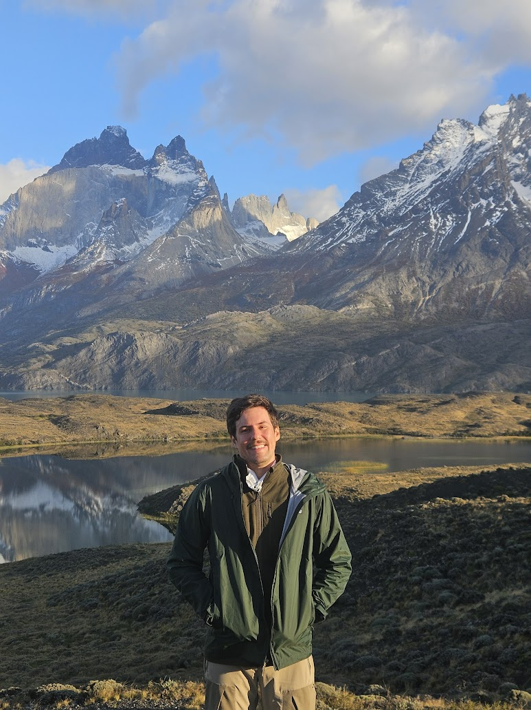

::: {.home-grid}

::: {.home-left}

{.home-photo}

<!-- Torres del Paine, Patagonia, Chile. Photo is a native 3:4 portrait, matching
     the .home-photo aspect-ratio in theme.scss, so it renders full-frame. -->

# Raphael Ludwig

::: {.contact-links}
[LinkedIn](https://www.linkedin.com/in/raphael-ludwig-167347414)

[Email](mailto:raphaludwig@gmail.com)

[CV](cv/Raphael_Ludwig_CV.pdf){target="_blank"}
:::

::: {.about-block}
### Previous positions
Economist, Vista Capital (2020–2026)
:::

::: {.about-block}
### Education
MSc Economics, PUC-Rio (2019–2021)\
[Master's thesis](https://www.econ.puc-rio.br/api/uploads/adm/trabalhos/files/15_set_2021_1912142_2021_Completo.pdf){.thesis-link}\
BSc Economics, PUC-Rio (2013–2017)
:::

::: {.about-block}
### Interests
Macroeconomic research, forecasting & nowcasting, applied econometrics, macro-political scenario analysis, time series, machine learning
:::

:::

::: {.home-right}
## Latest exercises

:::{#home-listing}
:::

[View more →](blog/index.qmd){.view-more}
:::

:::
