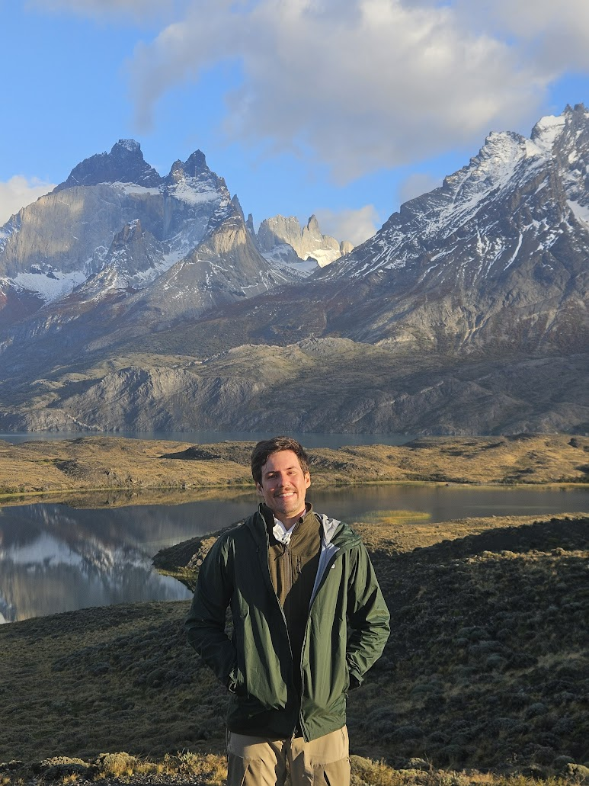

::: {.home-grid}

::: {.home-left}

{.home-photo}

<!-- Torres del Paine, Patagonia, Chile. Photo is a native 3:4 portrait, matching
     the .home-photo aspect-ratio in theme.scss, so it renders full-frame. -->

# Raphael Ludwig

:::: {.content-visible when-profile="en"}

::: {.contact-links}
[LinkedIn](https://www.linkedin.com/in/raphael-ludwig-167347414)

[Email](mailto:raphaludwig@gmail.com)

[CV](cv/Raphael_Ludwig_CV_EN.pdf){target="_blank"}
:::

::: {.about-block}
### Previous positions
Economist, Vista Capital (2020–May 2026)
:::

::: {.about-block}
### Education
MSc Economics, PUC-Rio (2019–2021)\
[Master's thesis](https://www.econ.puc-rio.br/api/uploads/adm/trabalhos/files/15_set_2021_1912142_2021_Completo.pdf){.thesis-link}\
BSc Economics, PUC-Rio (2013–2017)
:::

::: {.about-block}
### Interests
Macroeconomic research, forecasting & nowcasting, applied econometrics, macro-political scenario analysis, time series, machine learning
:::

::::

:::: {.content-visible when-profile="pt"}

::: {.contact-links}
[LinkedIn](https://www.linkedin.com/in/raphael-ludwig-167347414)

[E-mail](mailto:raphaludwig@gmail.com)

[CV](cv/Raphael_Ludwig_CV.pdf){target="_blank"}
:::

::: {.about-block}
### Posições anteriores
Economista, Vista Capital (2020–maio de 2026)
:::

::: {.about-block}
### Formação
Mestrado em Economia, PUC-Rio (2019–2021)\
[Dissertação de mestrado](https://www.econ.puc-rio.br/api/uploads/adm/trabalhos/files/15_set_2021_1912142_2021_Completo.pdf){.thesis-link}\
Graduação em Economia, PUC-Rio (2013–2017)
:::

::: {.about-block}
### Interesses
Pesquisa macroeconômica, previsão e nowcasting, econometria aplicada, análise de cenários macro-políticos, séries temporais, machine learning
:::

::::

:::

::: {.home-right}

:::: {.content-visible when-profile="en"}
## Latest exercises
::::

:::: {.content-visible when-profile="pt"}
## Últimos exercícios
::::

<!-- Hidden with CSS (.lang-*-only, in theme.scss) rather than when-profile: a
     listing whose target div is removed by the profile filter is not dropped,
     Quarto appends it to the end of the page instead. See blog/index.qmd. -->

:::: {.lang-en-only}
:::{#home-listing-en}
:::
::::

:::: {.lang-pt-only}
:::{#home-listing-pt}
:::
::::

:::: {.content-visible when-profile="en"}
[View more →](blog/index.qmd){.view-more}
::::

:::: {.content-visible when-profile="pt"}
[Ver mais →](blog/index-pt.qmd){.view-more}
::::

:::

:::
